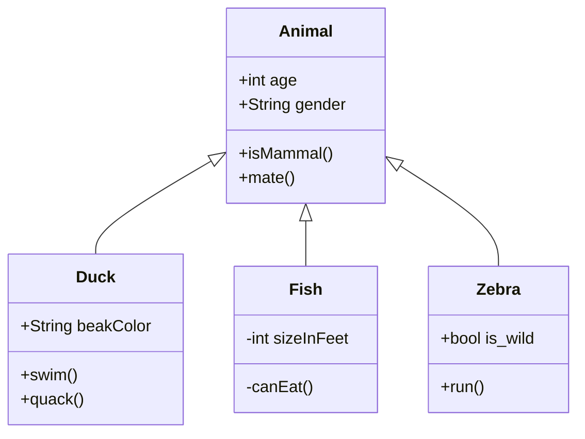
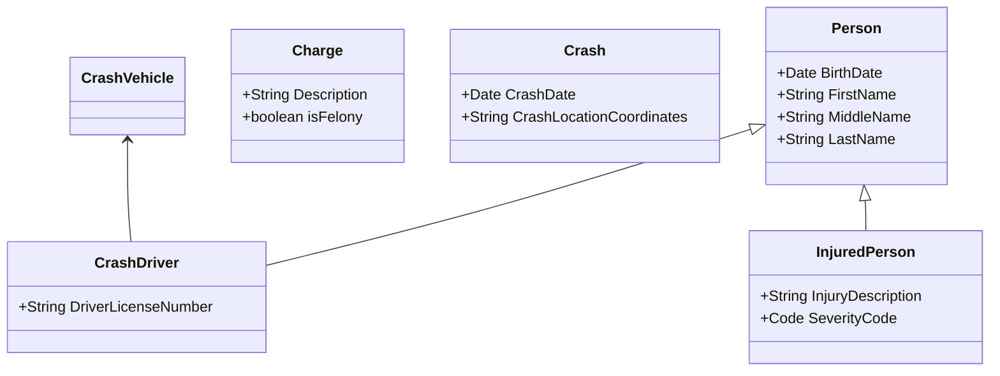
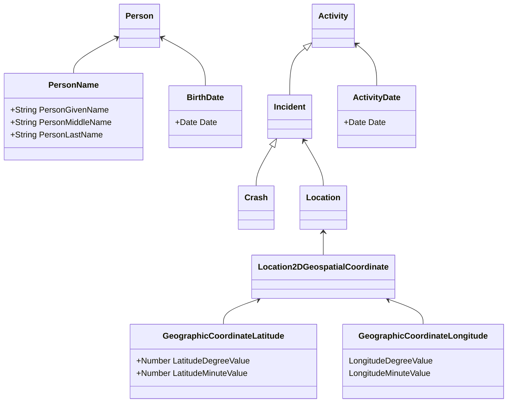

Command line is `mmdc`, https://github.com/mermaid-js/mermaid-cli

```
mmdc --input CrashDriverClassDiagram.mmd --output CrashDriverClassDiagram-neutral.svg --theme neutral
mmdc --input CrashDriverClassDiagram-NIEM.mmd --output CrashDriverClassDiagram-NIEM.svg --theme neutral
``



___
## Non-NIEM


___
## NIEM

