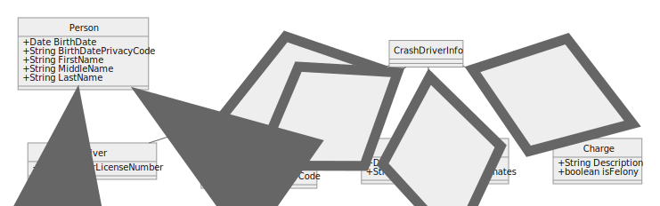
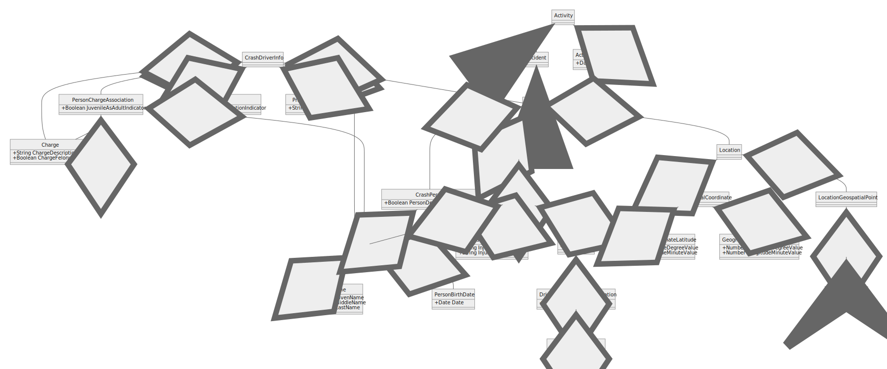

Ways to convert SVG to PNG

[SVG Export](https://github.com/shakiba/svgexport)

```
svgexport input.svg output.png 1.5x
```

[Apache Batik](https://xmlgraphics.apache.org/batik/tools/rasterizer.html)

```
java -jar batik-rasterizer.jar FILES
```

ImageMagick

```
convert test.svg test.png
```

Can't we just embed SVG? SVG won't expand to fill the screen. Also might not work in GitHub?







