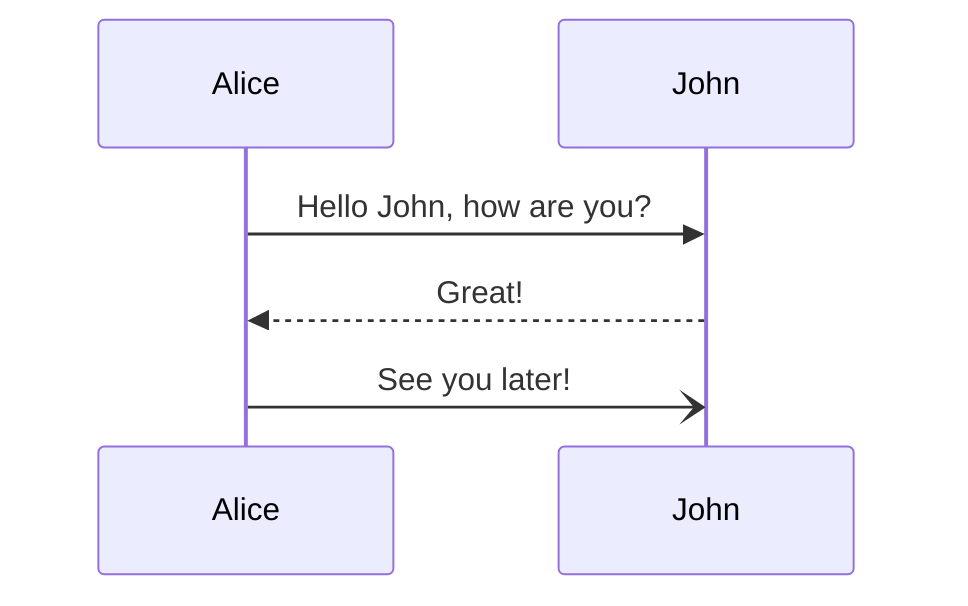
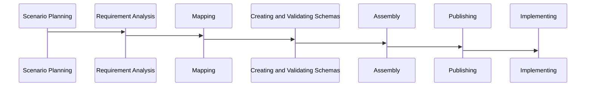
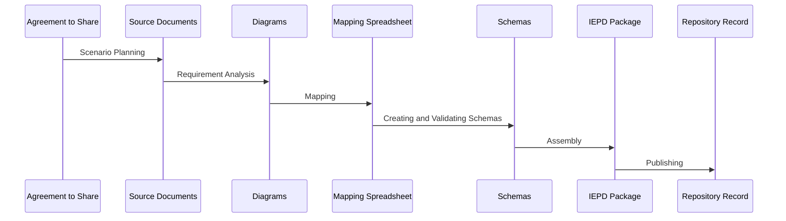
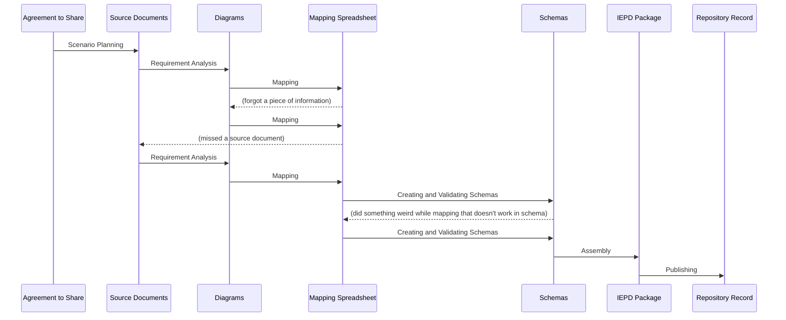

## Sample

```
mmdc --input DevSequence.mmd --output DevSequence.svg --theme neutral
mmdc --input DevSequence.mmd --output DevSequence.png --theme neutral
mmdc --input DevSequenceRealistic.mmd --output DevSequenceRealistic.svg --theme neutral
mmdc --input DevSequenceRealistic.mmd --output DevSequenceRealistic.png --theme neutral
```

```
/Applications/Inkscape.app/Contents/Resources/bin/inkscape -z -e DevSequenceRealistic.png -w 1024 -h 1024 DevSequenceRealistic.svg
```

Best conversion use [[rsvg-convert]]:

```
rsvg-convert DevSequenceRealistic.svg > DevSequenceRealistic.png
rsvg-convert DevSequence.svg > DevSequence.png
```

From [Mermaid Sequence Diagrams](https://mermaid-js.github.io/mermaid/#/sequenceDiagram):



___

## IEPD Development Steps

### Steps as States
This isn't right. The steps should be the sequence arrows, with documents as each step.



### Artifacts as Steps





