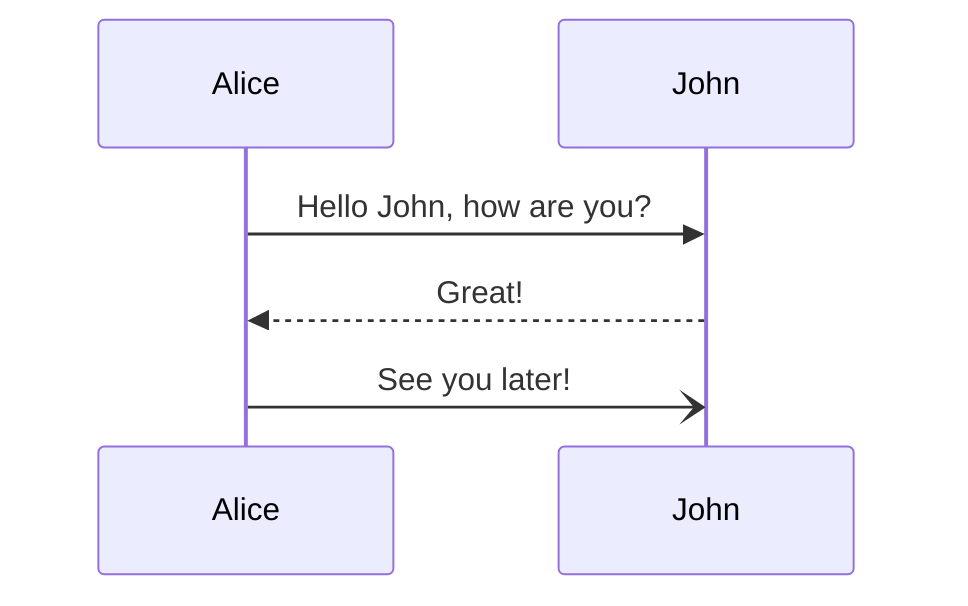
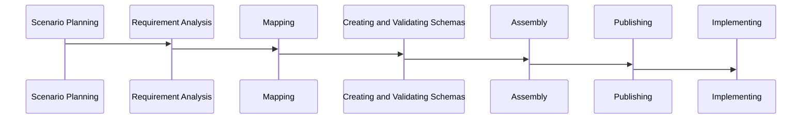
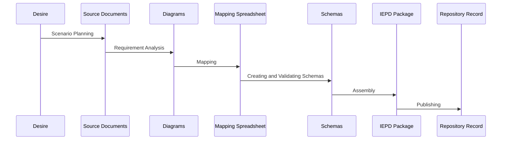

## Sample

```
mmdc --input DevSequence.mmd --output DevSequence.svg --theme neutral
```

From [Mermaid Sequence Diagrams](https://mermaid-js.github.io/mermaid/#/sequenceDiagram):



___

## IEPD Development Steps

### Steps as States
This isn't right. The steps should be the sequence arrows, with documents as each step.



### Artifacts as Steps



