# Master NIEM Training Document
NIEM Training
November 16-18, 2021

Tom Carlson
tom@tomcarlsonconsulting.com
GTRI / NIEM Consultant

<!-- TOC -->
# Introduction

## Purpose

A technical webinar focused on developers and implementers who are interested in a deep-dive of the National Information Exchange Model.
___
## Agenda

- Logistics
- Introduction to NIEM
- Introduction to IEPD Development
	- Scenario Planning
	- Requirements Analysis
	- Mapping
		- Intro to Mapping
		- Mapping to Existing Objects
		- Creating New Objects
		- External Standards
	- Creating and Validating Schemas
	- Assembly
	- Publishing
	- Implementation
- Resources
___
## Logistics

- Three days, 1-4pm each day
- Short breaks on the hour
- Ask questions via chat when you have them
	- Someone is monitoring chat
- This document and supporting materials at:
	- https://github.com/niem/niem-training
___
## Introduction to NIEM

- What is NIEM?
- The Scope of NIEM
- NIEM Harmonization and Organization
___
### What is NIEM? - Framework
- NIEM is a community-driven, government and jurisdiction-wide, standards-based approach to exchanging information
- Diverse communities can collectively leverage NIEM to increase efficiencies and improve decision-making
- NIEM is available to everyone, including public and private organizations
- NIEM includes a data model, governance, training, tools, technical support services, and an active community to assist users in adopting a standards-based approach to exchanging data


___
### What is NIEM? – Interop Problem
- If we don’t understand what each other means, we won’t be able to exchange info
- Need a common language for defining things


___
### What is NIEM? And what not?
**NIEM is:**
- a common vocabulary
- a means of enabling efficient information exchange across diverse public and private - organizations

**NIEM is not:**
- a system or database
- a means of specifying how to transmit or store data
___
### What is NIEM? – Exchanging Data and Components
- Using NIEM, organizations come together to agree on a common vocabulary
- When additional organizations are added to the information exchange, the initial NIEM exchange can be reused, saving time and money


___
### What is NIEM? – Simplified Exchanges
- When using NIEM, you only need to “speak” two languages: your own and NIEM

| Without NIEM | With NIEM |
| --- | --- |
|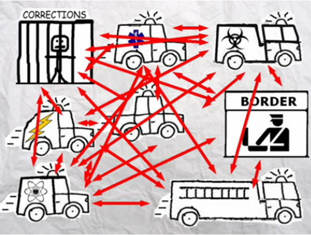|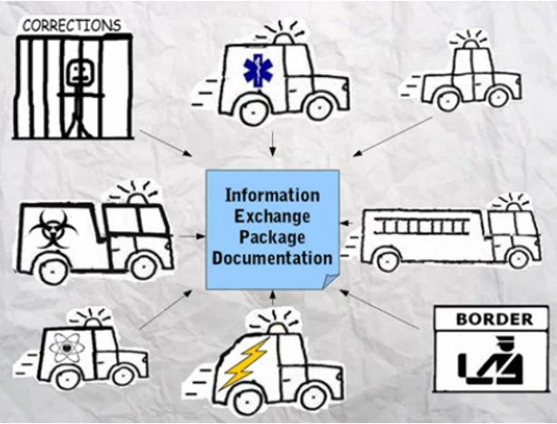|
___
### Scope of NIEM
- NIEM is a data layer standard and intentionally does not address all the necessary technologies needed for information sharing
- Exchange partners decide how to store and process the NIEM-conformant data being exchanged
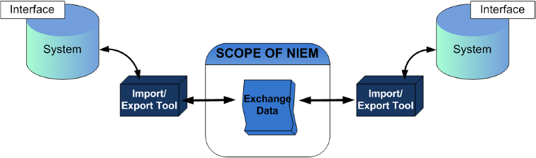
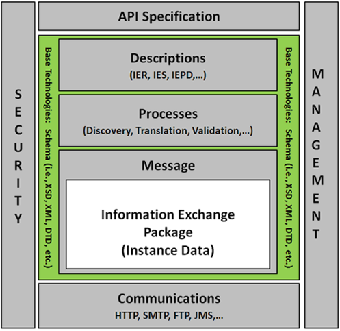
___
### Scope of NIEM - Open Source Interconnection (OSI) model

**Detailed:**

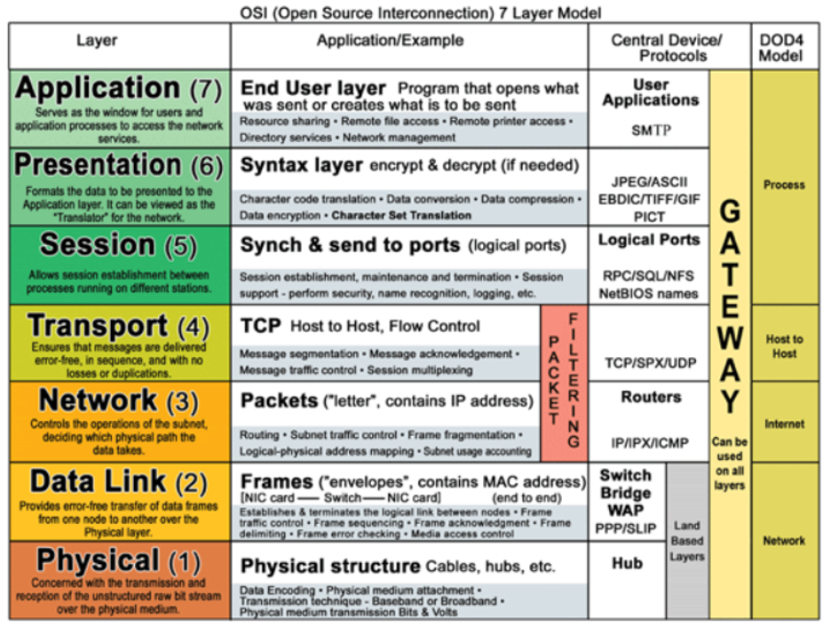

**Simplified:**

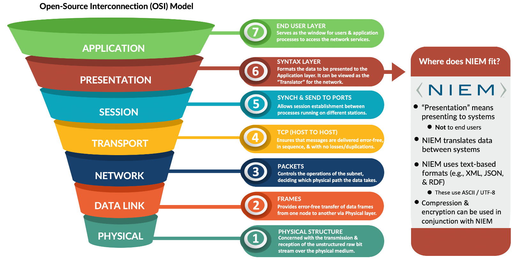
___
### Bottle of Liquid
**A bottle of liquid:**

- Has a shape
- Made of certain materials
- Can be opaque or transparent
- Has some combination of liquids inside
- Is moved around by various means


- NIEM is the liquid inside, the payload document
- NIEM doesn’t care about how you filled the bottle, how the bottle is constructed, how the bottle is transported, whether you can see into the bottle, and what you do with the liquid after you pour it out


___
### NIEM Harmonization and Organization

- Think of the NIEM data model as a mature and stable data dictionary of agreed-upon terms, definitions, relationships and formats independent of how information is stored in individual agency systems
- The data model consists of two sets of closely related vocabularies:
	- NIEM core
	- Individual NIEM domains
- NIEM core includes data elements commonly agreed upon across all NIEM domains (i.e., person, activity, location, and item, etc.)
- Individual NIEM domains contain mission-specific data components that build upon NIEM core concepts

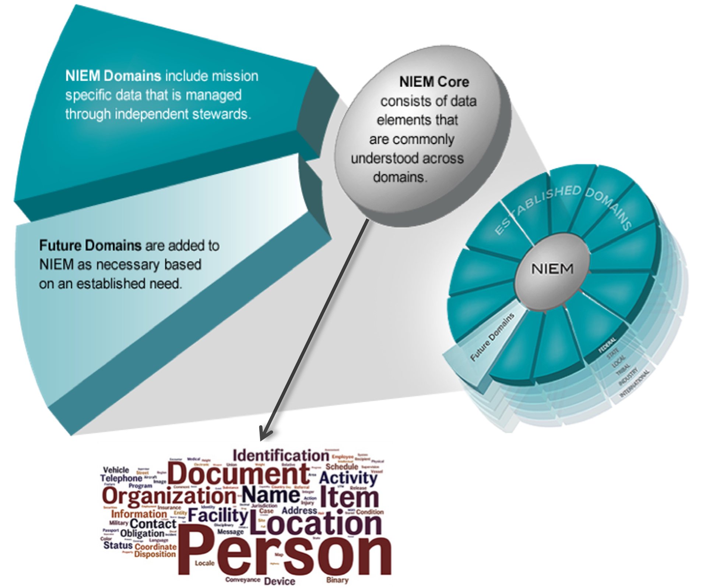

| Existing Domains                              | Upcoming Domains             |
| --------------------------------------------- | ---------------------------- |
| Agriculture                                   | Learning and Development     |
| Biometrics                                    | International Human Services |
| Chemical, Biological, Radiological, & Nuclear |                              |
| Cyber                                         |                              |
| Emergency Management                          |                              |
| Human Services                                |                              |
| Immigration                                   |                              |
| Infrastructure Protection                     |                              |
| Intelligence                                  |                              |
| International Trade                           |                              |
| Justice                                       |                              |
| Maritime                                      |                              |
| Military Operations                           |                              |
| Screening                                     |                              |
| Surface Transportation                        |                              |

**NIEM Versioning**

TODO: Add versioning information

**NIEM Administration Organization**

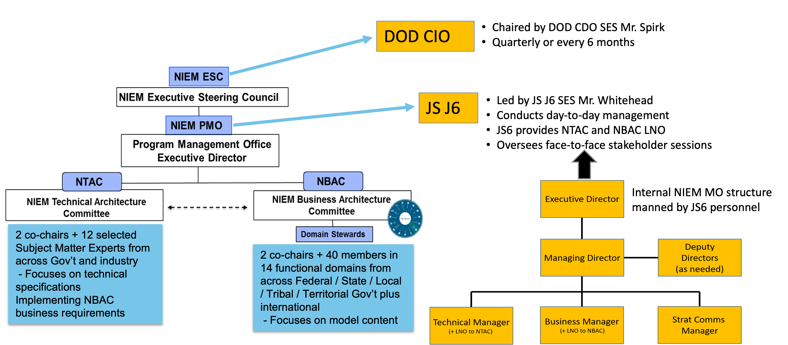
___

# Message Spec / IEPD Overview
- "Information Exchange Package Documentation"
- Slowly changing to "Message Specification"
- Defines an exchange
- Made up of a bunch of documents, "artifacts"
	- Some meant for humans
	- Some meant for computers
___
## Message Spec Process
Creating a Message Spec is a multi-step process
1. Scenario Planning
2. Requirements Analysis
3. Mapping
4. Assembly
5. Publishing
6. (Implementation)

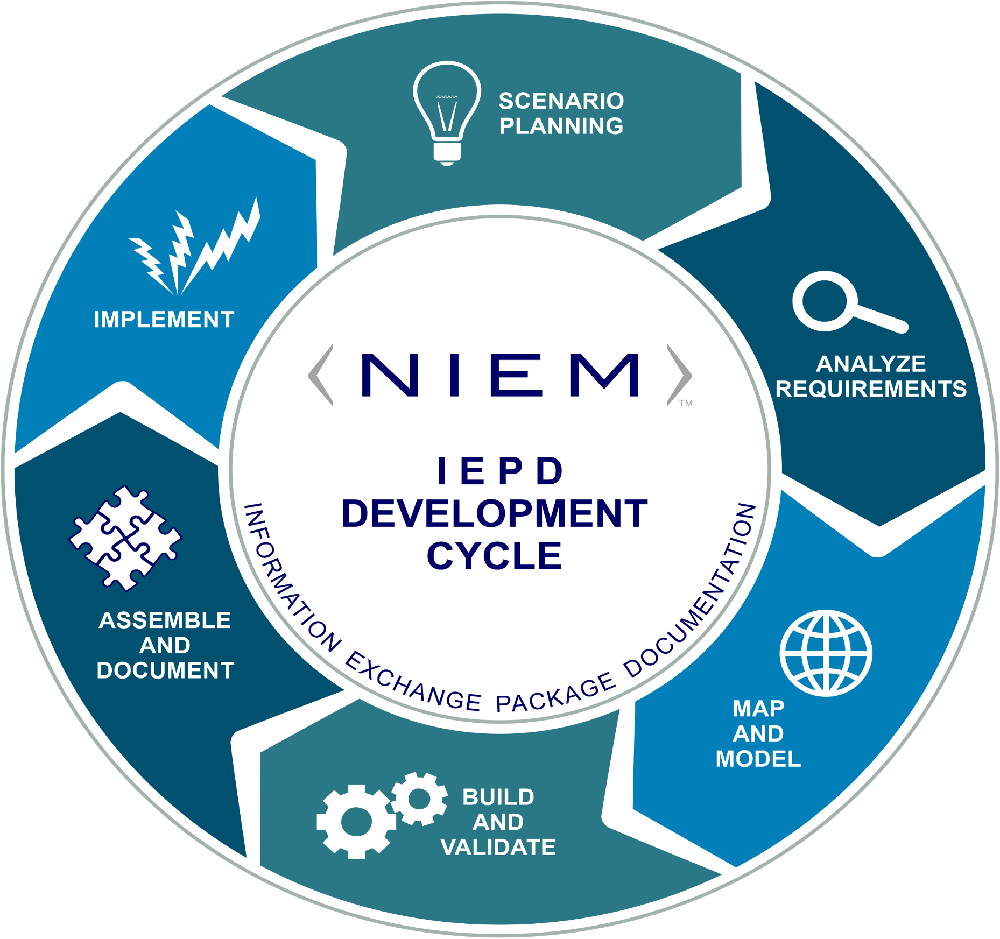

Each step produces artifacts used by subsequent steps:

1. A clue as to what you're doing...
2. UML Diagrams
3. Mapping Spreadsheet
4. Schemas and Instance Documents
5. Textual Documents
6. Code

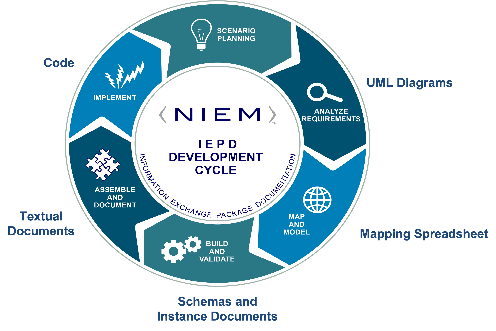

**Message Spec / IEPD Process – Idealized**

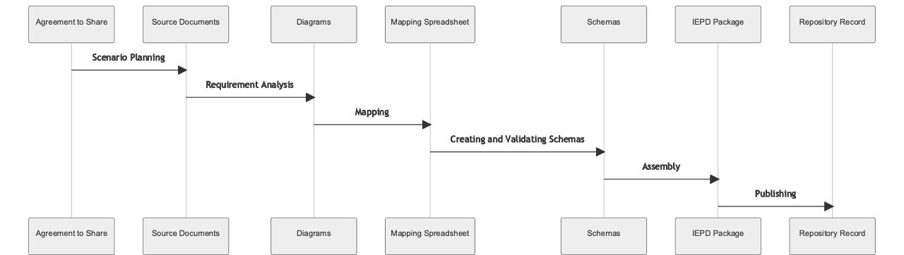

**Message Spec / IEPD Process – Real Life**

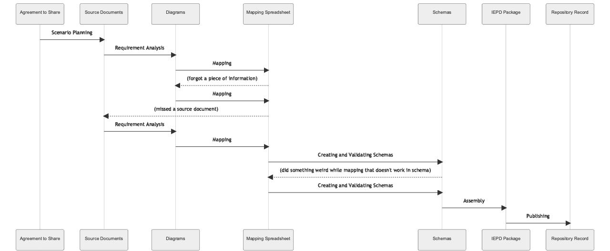
___
### IEPD Artifacts - Documentation
- Master Documentation (Word)
- IEPD catalog document (`iepd-catalog.xml`)
- Change log (text)
- README (text)
- Conformance assertion (text)
___
### IEPD Artifacts - Definitional
- Wantlist (`wantlist.xml`)
- Schema subset schemas
- Extension schemas
- Exchange schemas
- Sample instances
- XML catalogs
___
## Scenario Planning
- Decide what the exchange is about
- Who are the exchange partners?
- Who are stakeholders?
- Communication is key
- Existing exchanges or other documentation can help
	- Within your organization
	- From NIEM repositories (_huge caveat_)

___
### Existing Documentation

- Current technical architecture documents of all exchange partners
- Stakeholders that will be involved in the exchange
- Security, privacy, and other policy-related concerns associated with the exchange
- Technical characteristics of the exchange:
- Types of data being shared
- Number of data objects
	- Current structure of the data (logical, physical)
	- Use of external standards
___
## Requirements Analysis
- Diagrams
	- Use Case Diagrams
	- Business Process Diagrams
	- Sequence Diagrams
- Class Diagrams
- Spreadsheets
- Other documents

**Use Case Diagrams**

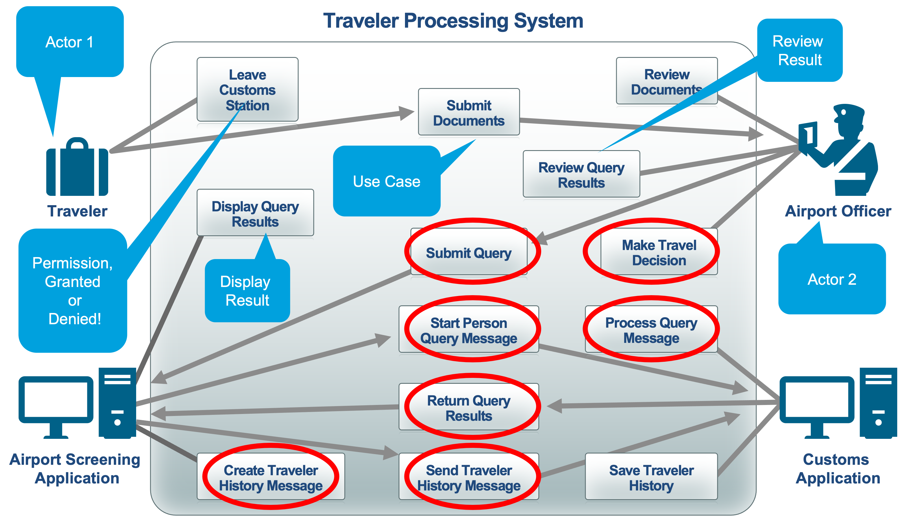

**Business Process Diagrams**

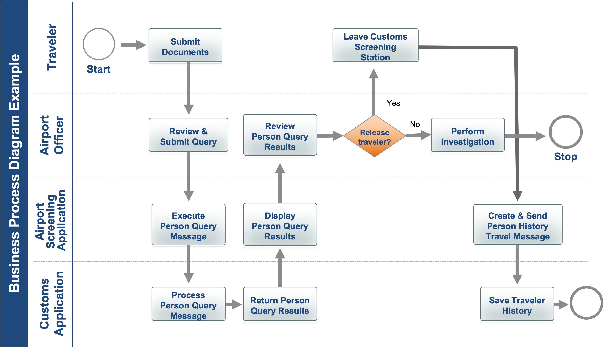

**Sequence Diagrams**

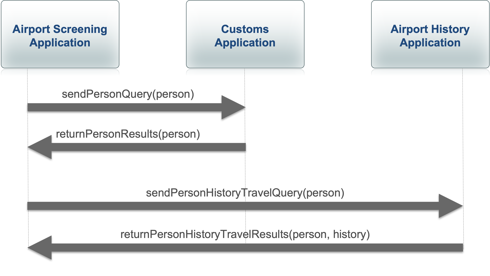
___
### UML Class Diagrams

- The bread and butter of IEPD business requirements
- Can be oriented towards business terms and objects
	- Better for consensus
- Can be oriented towards NIEM terms and objects
	- Pre-loads the mapping step
___
### Business Oriented Class Diagram

Representing objects in UML by their business names and relationships.

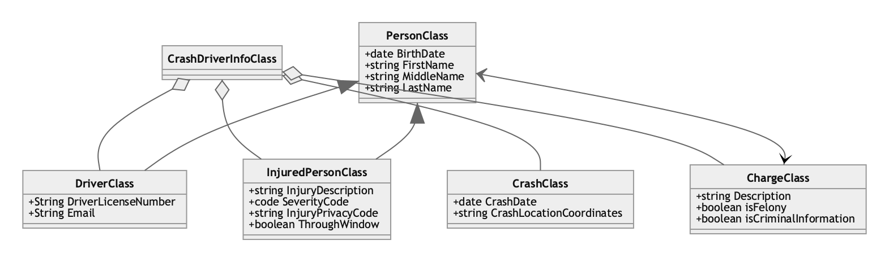
___
### NIEM Oriented Class Diagram

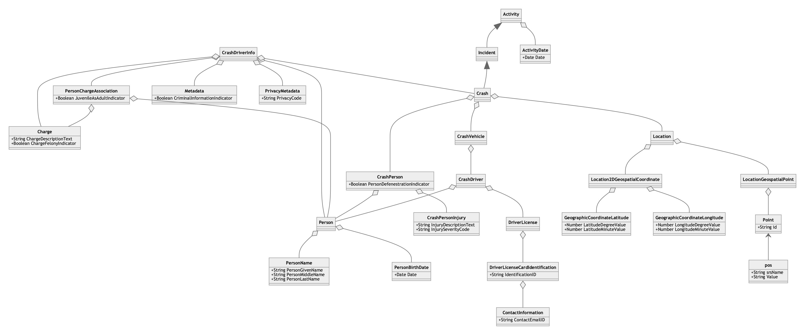

**Close-ups:**

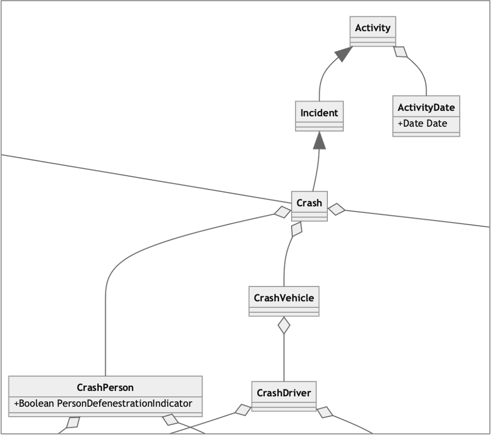
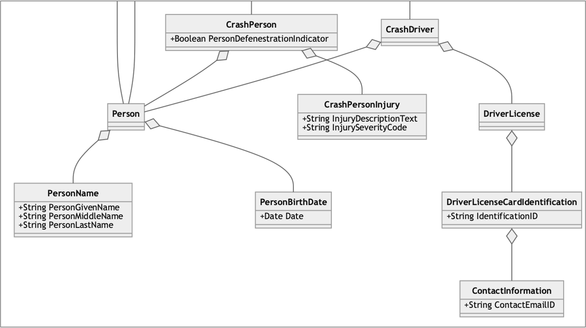
___
### UML Tools
- [ArgoUML](https://en.wikipedia.org/wiki/ArgoUML)
- [BOUML](https://en.wikipedia.org/wiki/BOUML)
- [MagicDraw](https://en.wikipedia.org/wiki/MagicDraw) / [Rational Rose](https://en.wikipedia.org/wiki/IBM_Rational_Rose_XDE) (\$\$\$)
- [Visio](https://en.wikipedia.org/wiki/Microsoft_Visio) / [OmniGraffle](https://en.wikipedia.org/wiki/OmniGraffle)
- [Graphviz](https://graphviz.org/) / [Mermaid](https://mermaid-js.github.io/mermaid/#/)
- Many more…
___
### Business Rules
- Some rules are _not_ easily represented in UML
- You can use whatever works for your needs
- Schematron for XML
	- e.g. Birth dates must be in the past, salutations matching gender
- Plain old textual descriptions are great!
___
### The Process from Here On…

We have choices on how to proceed:

- Step-by-step
	- Finish mapping entirely before starting schemas
- Concurrent
	- Building schemas and instances as you go
- We'll use something in-between
	- Build an ersatz matching instance document as we map
	- Sorta like YAML without data values
	- Save schemas for the end

(Will use a super secret tool to help with some of this!)
___
## Mapping
For this entire section, we'll look at various things in the mapping spreadsheet and show how to map them to NIEM or to new elements that we'll create later. As we move through, we'll cover all the major aspects of how NIEM works.
___
### Introduction to Mapping
- Mapping Spreadsheets Options
	- NIEM Mapping Template
	- Simple Training Spreadsheet
	- Something In-between
- Document Business Objects
- Map them to NIEM objects, existing or new
- Maintaining an Ongoing Sample Instance Skeleton
___
### NIEM Mapping Template
- Primarily for submitting content for inclusion in NIEM
	- Eight different tabs
- Can also be used for mapping in an IEPD
	- Just need one of the tabs, mainly
- Is a bit overkill for a Message Spec
___
### Simple Training Spreadsheet
- Minimal
- Designed to be simple enough to fit on slides
	- No, really, that’s the constraint
- Usually expanded in practice

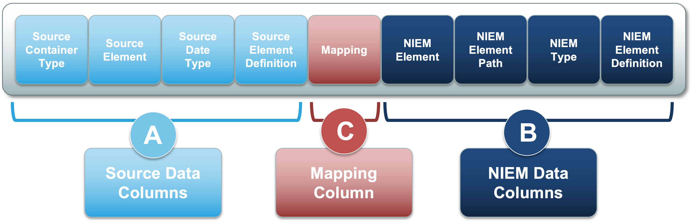
___
### Tom’s Custom Mapping Spreadsheet
- Has evolved over time
- Contains all the info needed to make schemas
- Not as overwhelming as the NIEM Mapping Template
- Works with the NIEM Linter
- You can make your own custom one
	- The IEPD Spec doesn’t specify a required format, by design
___
### Basics of Searching NIEM
**Tools**
- SSGT
- Wayfarer
- NIEM Schemas
- Spreadsheet

**Techniques**
- Search for Terms
	- Simple vs Advanced
- Search for Synonyms
- Search for Word Roots
- Search for Containers
- Search for Properties
___
# Mapping and NIEM Technical Details

## Understanding NIEM Objects
- XML Schema uses elements and types
- What an element can hold is based on its type
- What you are (your type) defines what you can hold

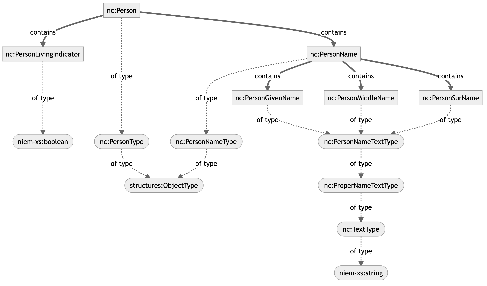

### XML Schema

**The XML Schema defining [`nc:Person`](http://niem5.org/schemas/nc.html#Person) and [`nc:PersonType`](http://niem5.org/schemas/nc.html#PersonType) looks like:**

```xml
<xs:element name="Person" type="nc:PersonType" nillable="true">
	<xs:annotation>
		<xs:documentation>A human being.</xs:documentation>
	</xs:annotation>
</xs:element>

<xs:complexType name="PersonType">
	<xs:annotation>
		<xs:documentation>A data type for a human being.</xs:documentation>
	</xs:annotation>
	<xs:complexContent>
		<xs:extension base="structures:ObjectType">
			<xs:sequence>
				<xs:element ref="nc:PersonAccentText" minOccurs="0" maxOccurs="unbounded"/>
				<xs:element ref="nc:PersonAgeDescriptionText" minOccurs="0" maxOccurs="unbounded"/>
				<!-- A whole slew of objects removed for clarity -->
				<xs:element ref="nc:PersonName" minOccurs="0" maxOccurs="unbounded"/>
				<!-- A whole slew of objects removed for clarity -->
				<xs:element ref="nc:PersonHomeContactInformation" minOccurs="0" maxOccurs="unbounded"/>
				<xs:element ref="nc:PersonAugmentationPoint" minOccurs="0" maxOccurs="unbounded"/>
			</xs:sequence>
		</xs:extension>
	</xs:complexContent>
</xs:complexType>

```

**The XML Schema defining [`nc:PersonName`](http://niem5.org/schemas/nc.html#PersonName) and [`nc:PersonNameType`](http://niem5.org/schemas/nc.html#PersonNameType) looks like:**

```xml
<xs:element name="PersonName" type="nc:PersonNameType" nillable="true">
	<xs:annotation>
		<xs:documentation>A combination of names and/or titles by which a person is known.</xs:documentation>
	</xs:annotation>
</xs:element>

<xs:complexType name="PersonNameType">
	<xs:annotation>
		<xs:documentation>A data type for a combination of names and/or titles by which a person is known.</xs:documentation>
	</xs:annotation>
	<xs:complexContent>
		<xs:extension base="structures:ObjectType">
			<xs:sequence>
				<xs:element ref="nc:PersonNamePrefixAbstract" minOccurs="0" maxOccurs="unbounded"/>
				<xs:element ref="nc:PersonGivenName" minOccurs="0" maxOccurs="unbounded"/>
				<xs:element ref="nc:PersonMiddleName" minOccurs="0" maxOccurs="unbounded"/>
				<xs:element ref="nc:PersonSurName" minOccurs="0" maxOccurs="unbounded"/>
				<xs:element ref="nc:PersonNameSuffixText" minOccurs="0" maxOccurs="unbounded"/>
				<xs:element ref="nc:PersonMaidenName" minOccurs="0" maxOccurs="unbounded"/>
				<xs:element ref="nc:PersonFullName" minOccurs="0" maxOccurs="unbounded"/>
				<xs:element ref="nc:PersonNameCategoryAbstract" minOccurs="0" maxOccurs="unbounded"/>
				<xs:element ref="nc:PersonNameSalutationText" minOccurs="0" maxOccurs="unbounded"/>
				<xs:element ref="nc:PersonOfficialGivenName" minOccurs="0" maxOccurs="unbounded"/>
				<xs:element ref="nc:PersonPreferredName" minOccurs="0" maxOccurs="unbounded"/>
				<xs:element ref="nc:PersonSurNamePrefixText" minOccurs="0" maxOccurs="unbounded"/>
				<xs:element ref="nc:EffectiveDate" minOccurs="0" maxOccurs="unbounded"/>
				<xs:element ref="nc:PersonNameAugmentationPoint" minOccurs="0" maxOccurs="unbounded"/>
			</xs:sequence>
			<xs:attribute ref="nc:personNameCommentText" use="optional"/>
		</xs:extension>
	</xs:complexContent>
</xs:complexType>
```

**The XML Schema defining [`nc:PersonGivenName`](http://niem5.org/schemas/nc.html#PersonGivenName), [`PersonNameTextType`](http://niem5.org/schemas/nc.html#PersonNameTextType), and supporting types looks like:**

```xml
<xs:element name="PersonGivenName" type="nc:PersonNameTextType" nillable="true">
	<xs:annotation>
		<xs:documentation>A first name of a person.</xs:documentation>
	</xs:annotation>
</xs:element>

<xs:complexType name="PersonNameTextType">
	<xs:annotation>
		<xs:documentation>A data type for a name by which a person is known, referred, or addressed.</xs:documentation>
	</xs:annotation>
	<xs:simpleContent>
		<xs:extension base="nc:ProperNameTextType">
			<xs:attribute ref="nc:personNameInitialIndicator" use="optional"/>
		</xs:extension>
	</xs:simpleContent>
</xs:complexType>

<xs:complexType name="ProperNameTextType">
	<xs:annotation>
		<xs:documentation>A data type for a word or phrase by which a person or thing is known, referred, or addressed.</xs:documentation>
	</xs:annotation>
	<xs:simpleContent>
		<xs:extension base="nc:TextType"/>
	</xs:simpleContent>
</xs:complexType>

<xs:complexType name="TextType">
	<xs:annotation>
		<xs:documentation>A data type for a character string.</xs:documentation>
	</xs:annotation>
	<xs:simpleContent>
		<xs:extension base="niem-xs:string">
			<xs:attribute ref="nc:partialIndicator" use="optional"/>
			<xs:attribute ref="nc:truncationIndicator" use="optional"/>
			<xs:attribute ref="xml:lang" use="optional"/>
		</xs:extension>
	</xs:simpleContent>
</xs:complexType>

```

**The resulting instance document that all this creates might look like this:**

```xml
<nc:Person>
	<nc:PersonName nc:personNameCommentText="copied">
		<nc:PersonGivenName>Peter</nc:PersonGivenName>
		<nc:PersonMiddleName>Death</nc:PersonMiddleName>
		<nc:PersonMiddleName>Bredon</nc:PersonMiddleName>
		<nc:PersonSurName>Wimsey</nc:PersonSurName>
	</nc:PersonName>
</nc:Person>
```
___
### What About JSON?

NIEM can be used with JSON via [JSON-LD](https://en.wikipedia.org/wiki/JSON-LD). JSON-LD extends JSON to allow for meaningfully linking data together. NIEM leverages JSON-LD in two ways:

1. NIEM uses `@context` to provide a mapping from JSON object names back to their counterparts in NIEM
2. NIEM uses `@id` to provide links between JSON objects

Linking is a topic for later in the class, but here is an example of the `@context`. This context tells us that `nc:Person` refers to the `Person` object in the NIEM-Core namespace.

```json
{
	"@context": {
		"nc": "http://release.niem.gov/niem/niem-core/5.0/#"
	},
	"nc:Person": {
		"nc:PersonName": {
			"nc:personNameCommentText": "copied",
			"nc:PersonGivenName": "Peter",
			"nc:PersonSurName": "Wimsey"
		}
	}
}

```
There are other means to shorten long NIEM names into names more amenable to JSON developers via [normalization](https://github.com/TomCarlson-NTAC/NIEM-JSON-Spec/wiki), but that topic is outside the scope of the training.

Note that the structure of the JSON mirrors the structure of the XML. NIEM with JSON does require mirroring the structure.

JSON-LD and JSON Schema are separate concepts. NIEM does not _yet_ support JSON Schema, although efforts are underway to enable that. Currently, JSON with NIEM is all about the JSON instance documents. NIEM itself is still defined in XML Schema.

Throughout the training, matching JSON instances will be included with XML instances.

___
## Mapping to Native Properties
- Some things will be easy to find
- Will map directly to NIEM objects
- Examples:
	- `nc:Person`, `nc:PersonName`, `nc:PersonGivenName`, etc.
	- Search for `nc:Person` in the [SSGT](http://niem5.org/ssgt_redirect.php?query=person)
	- Search for `nc:Person` in [Wayfarer](http://niem5.org/wayfarer/search.php?option=exact&query=person)
___
## Substitution Groups

- Some concepts can be represented multiple ways
- Text / code combinations are common
- Date can be a date, datetime, or a range
- NIEM uses substitution groups to support both:
	- The single concept, and
	- Multiple representations of that concept
- Examples:
	- `nc:PersonBirthDate` ([SSGT](https://tools.niem.gov/niemtools/ssgt/SSGT-GetProperty.iepd?propertyKey=o3-11r)/[Wayfarer](http://niem5.org/wayfarer/nc/PersonBirthDate.html))
	- Heads follow the form of: `SomethingRepresentation` or `WhateverAbstract`
___
## Namespaces
- Namespaces organize elements by context
- Identified by prefix, a nickname for the namespace
- NIEM governance is organized along these lines

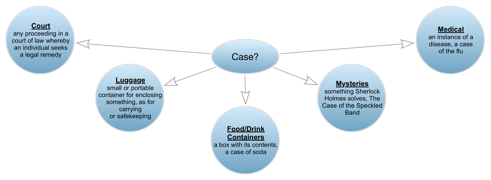

JSON-LD maps JSON objects to NIEM namespaces in the `@context`.
___
## Inherited Properties
- NIEM is a model, not a flat data dictionary
- Some concepts don’t exist as elements using the terms for the concept
- Instead, properties are inherited
- There is no “Crash Date” in NIEM ([SSGT](http://niem5.org/ssgt_redirect.php?query=crash+date)/[Wayfarer](http://niem5.org/wayfarer/search.php?option=both&query=crash+date))
- There _is_ an `ActivityDate` which can be inside a `Crash` object ([SSGT](https://tools.niem.gov/niemtools/ssgt/SSGT-GetProperty.iepd?propertyKey=o3-44f)/[Wayfarer](http://niem5.org/wayfarer/j/Crash.html))
___
## Code Tables
- Codes help ensure accurate information
- Codes are, essentially, strings, simple data
	- Elements in the domains
	- Types are often in their own namespaces
- NIEM wraps them in a complex type in order to apply some attributes needed for infrastructure
	- Which we will need in the next section…
- Examples:
	- `j:InjurySeverityCode` ([SSGT](https://tools.niem.gov/niemtools/ssgt/SSGT-GetProperty.iepd?propertyKey=o3-45s)/[Wayfarer](http://niem5.org/wayfarer/j/InjurySeverityCode.html))
		- In the SSGT, the actual codes are viewable on the page for the base simple type, e.g. [`aamva_d20:AccidentSeverityCodeSimpleType`](https://tools.niem.gov/niemtools/ssgt/SSGT-GetType.iepd?typeKey=o3-c)
		- In Wayfarer, there should be a link on the element page bringing up the codes in a separate window, e.g. [`aamva_d20:AccidentSeverityCodeSimpleType`]((http://niem5.org/wayfarer/aamva_d20/AccidentSeverityCodeSimpleType_codes.html)
	- Anything ending in “Code”

___
## Linking Things Together
- NIEM is relational in many senses
- Objects can refer to each other across an XML hierarchy
- Allows NIEM to represent real world, many-to-many relationships
- `structures` namespace provides the infrastructure to make this work

### NIEM Structural "Layers"

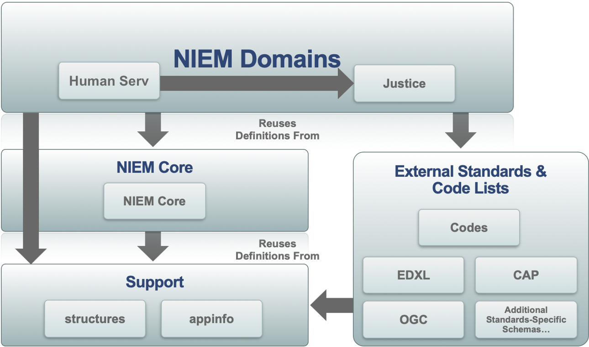

## Referencing - XML Schema
- NIEM lets you assign unique IDs to object
- Other objects can then link to those objects by referencing the ID
- Everything in NIEM can have attributes for this:
	- `id`
	- `ref`
	- `metadata`
- These leverage built-in XML Schema attributes `ID`, `IDREF`, and `IDREFS`
___
## Referencing - JSON-LD

TODO: Add JSON-LD linking here.


Combining Domains is where we start to have content.
___
## Associations
- Relationships can be complex
- NIEM provides powerful Association objects
- Trade-off can be implementation complexity

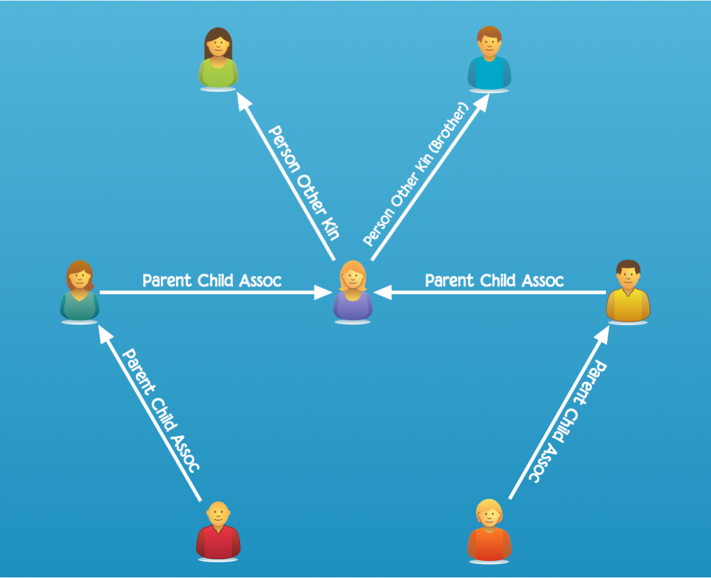

- Associations link objects together
	- Associations reference the associated objects
	- Can link to multiple objects
	- Can thus form many-to-many relationships between them
- Associations also hold information about the association itself
	- `Date` or `DateRange` is a common example
- Associations can also just include them, if applicable
- Examples:
	- `j:PersonChargeAssociation` ([SSGT](https://tools.niem.gov/niemtools/ssgt/SSGT-GetProperty.iepd?propertyKey=o3-4qf)/[Wayfarer](http://niem5.org/wayfarer/j/PersonChargeAssociation.html))
	- Anything ending in “Association”
___
## Roles
- Modeling some objects as specialized things gets complicated
- Roles are, well, roles that objects play
	- People, organizations, items are the major ones
- Roles reference the objects playing the role
	- Objects can thus play multiple roles
- Roles can also just include the object playing the role
- Roles contain other information about the role
- Examples:
	- `j:CrashPerson` ([SSGT](https://tools.niem.gov/niemtools/ssgt/SSGT-SearchSubmit.iepd)/[Wayfarer](http://niem5.org/wayfarer/j/CrashPerson.html))
	- Anything containing an nc:RoleOfPerson, Org, or Item

### Roles - Not Special Kinds of People

| Roles | Just a Guy |
| --- | --- |
|  |  |

### Roles – Allows an Object to Play Multiple Roles


### Roles - How They Work
Roles Point to the Object Playing the Role:


Roles Contain Info About the Role

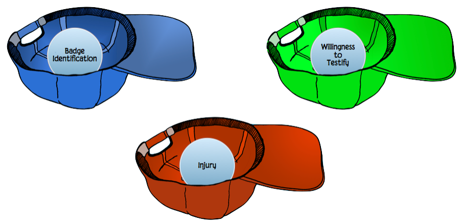
___
## Metadata
### Metadata is Data about Data


| Data | Metadata |
| --- | --- |
| _Name:_ **Jett** | _Reporting Organization:_ **Godspeed Animal Care** |
| _Sex:_ **Female** | _Reporting Person:_ **Dr. Shiller** |   
| _Weight:_ **8 pounds** |_Reported Date:_ **2019-12-13** |
| | _Last Verified Date:_ **2021-06-10** |

- Objects reference the metadata objects that apply to them
- An objects can reference more than one metadata object
- More than one object can reference the same metadata object
- Example: `j:Metadata` (containing `j:CriminalInformationIndicator`) ([SSGT](https://tools.niem.gov/niemtools/ssgt/SSGT-GetProperty.iepd?propertyKey=o3-4qr)/[Wayfarer](http://niem5.org/wayfarer/j/Metadata.html))

### Connecting Metadata to Objects

| Connections | Diagram |
| --- | --- |
| Easy to apply same metadata to many objects |  |
| Easy to apply multiple metadata objects to one object | 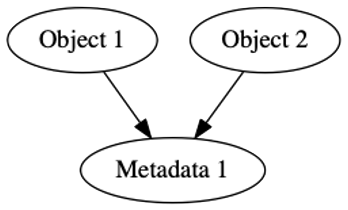 |
| Many-to-many relationships can get messy | 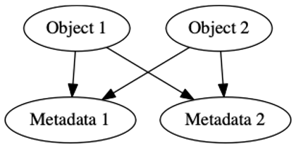 |

**Powerful, but can be difficult to implement**

## Combining Domains
- Sometimes you just want to add properties from other domains to an object without making a special kind of thing
- Augmentations are bags of stuff
- Augmentation Points are hooks onto which to hang the bags of stuff
- Augmentations are an easy way to extend objects to meet your exchange needs
- Examples:
	- `j:DriverLicense` ([SSGT](https://tools.niem.gov/niemtools/ssgt/SSGT-GetProperty.iepd?propertyKey=o3-lb))
	- `j:DriverLicenseAugmentationPoint` ([SSGT](https://tools.niem.gov/niemtools/ssgt/SSGT-GetProperty.iepd?propertyKey=o3-11rg))

### Schemas

**`j:DriverLicense` is defined to be of `j:DriverLicenseType`:**

```xml
<xs:element name="DriverLicense" type="j:DriverLicenseType" nillable="true">
	<xs:annotation>
		<xs:documentation>A license issued to a person granting driving privileges.</xs:documentation>
	</xs:annotation>
</xs:element>
```

**`j:DriverLicenseType` contains `j:DriverLicenseAugmentationPoint` as a hook for a augmentation bags:**

```xml
<xs:complexType name="DriverLicenseType">
	<xs:annotation>
		<xs:documentation>A data type for a license issued to a person granting driving privileges.</xs:documentation>
	</xs:annotation>
	<xs:complexContent>
		<xs:extension base="j:DriverLicenseBaseType">
			<xs:sequence>
				<xs:element ref="j:DriverLicenseEnhancedIndicator" minOccurs="0" maxOccurs="unbounded"/>
				<xs:element ref="j:DriverLicenseCommercialClassAbstract" minOccurs="0" maxOccurs="unbounded"/>
				<xs:element ref="j:DriverLicenseCommercialStatusAbstract" minOccurs="0" maxOccurs="unbounded"/>
				<xs:element ref="j:DriverLicenseNonCommercialClassText" minOccurs="0" maxOccurs="unbounded"/>
				<xs:element ref="j:DriverLicenseNonCommercialStatusAbstract" minOccurs="0" maxOccurs="unbounded"/>
				<xs:element ref="j:DriverLicensePermit" minOccurs="0" maxOccurs="unbounded"/>
				<xs:element ref="j:DriverLicensePermitQuantity" minOccurs="0" maxOccurs="unbounded"/>
				<xs:element ref="j:DriverLicenseWithdrawal" minOccurs="0" maxOccurs="unbounded"/>
				<xs:element ref="j:DriverLicenseWithdrawalPendingIndicator" minOccurs="0" maxOccurs="unbounded"/>
				<xs:element ref="j:DriverLicenseCardIdentification" minOccurs="0" maxOccurs="unbounded"/>
				<xs:element ref="j:DriverLicenseRestriction" minOccurs="0" maxOccurs="unbounded"/>
				<xs:element ref="j:DriverLicenseEndorsement" minOccurs="0" maxOccurs="unbounded"/>
				<xs:element ref="j:DriverLicenseAugmentationPoint" minOccurs="0" maxOccurs="unbounded"/>
			</xs:sequence>
		</xs:extension>
	</xs:complexContent>
</xs:complexType>
```

**While NIEM does have some augmentations pre-defined, they're particularly useful for adding new object. Here we create a bag called `LicenseAugmentation` with `nc:ContactInformation` inside. We can now "hang" it on the `j:DriverLicenseAugmentationPoint` hook:**

```xml
<xs:complexType name="LicenseAugmentationType">
	<xs:annotation>
		<xs:documentation>
			A data type for additional information about a license.
		</xs:documentation>
	</xs:annotation>
	<xs:complexContent>
		<xs:extension base="structures:AugmentationType">
			<xs:sequence>
				<xs:element ref="nc:ContactInformation"/>
			</xs:sequence>
		</xs:extension>
	</xs:complexContent>
</xs:complexType>

<xs:element name="LicenseAugmentation" type="ext:LicenseAugmentationType" substitutionGroup="j:DriverLicenseAugmentationPoint">
	<xs:annotation>
		<xs:documentation>
			Additional information about a license.
		</xs:documentation>
	</xs:annotation>
</xs:element>
```

**Our new `ext:LicenseAugmentationType` is based on the built-in `structures:AugmentationType`. That base type merely adds in infrastructure support for linking objects together:**

```xml
<xs:complexType name="AugmentationType" abstract="true">
	<xs:annotation>
		<xs:documentation>A data type for a set of properties to be applied to a base type.</xs:documentation>
	</xs:annotation>
	<xs:attribute ref="structures:id"/>
	<xs:attribute ref="structures:ref"/>
	<xs:attribute ref="structures:uri"/>
	<xs:anyAttribute namespace="urn:us:gov:ic:ism urn:us:gov:ic:ntk" processContents="lax"/>
</xs:complexType>
```

**The resulting XML Instance Document looks like:**

```xml
<j:DriverLicense>
	<j:DriverLicenseCardIdentification>
		<nc:IdentificationID>A1234567</nc:IdentificationID>
	</j:DriverLicenseCardIdentification>
	<ext:LicenseAugmentation>
		<nc:ContactInformation>
			<nc:ContactEmailID>peter@wimsey.org</nc:ContactEmailID>
		</nc:ContactInformation>
	</ext:LicenseAugmentation>
</j:DriverLicense>
```

**The equivalent JSON-LD would be:**

```json
"j:DriverLicense": {
	"j:DriverLicenseCardIdentification": {
		"nc:IdentificationID": "A1234567"
	},
	"ext:LicenseAugmentation": {
		"nc:ContactInformation": {
			"nc:ContactEmailID": "peter@wimsey.org"
		}
	}
}
```

## External Standards
- NIEM supports external standards, if they’re XML
- Wraps them in NIEM-conformant adapters
- Example:
	- NIEM: `nc:LocationGeospatialCoordinateAbstract` ([SSGT](https://tools.niem.gov/niemtools/ssgt/SSGT-GetProperty.iepd?propertyKey=o3-125z)/[Wayfarer](http://niem5.org/wayfarer/nc/LocationGeospatialCoordinateAbstract.html))
	- NIEM-conformant adapter: geo:LocationGeospatialPoint ([SSGT](https://tools.niem.gov/niemtools/ssgt/SSGT-GetProperty.iepd?propertyKey=o3-m73))
	- External standard: `gml:Point` ([SSGT](https://tools.niem.gov/niemtools/ssgt/SSGT-GetProperty.iepd?propertyKey=o3-fux))
- You’ll probably never use this, but should know it’s there
- SSGT supports them; Wayfarer does not

### Schema Example

**`LocationType` contains a `nc:LocationGeospatialCoordinateAbstract`:**

```xml
<xs:complexType name="LocationType">
	<xs:annotation>
		<xs:documentation>A data type for geospatial location.</xs:documentation>
	</xs:annotation>
	<xs:complexContent>
		<xs:extension base="structures:ObjectType">
			<xs:sequence>
				<xs:element ref="nc:LocationAddressAbstract" minOccurs="0" maxOccurs="unbounded"/>
				<xs:element ref="nc:LocationArea" minOccurs="0" maxOccurs="unbounded"/>
				<xs:element ref="nc:LocationCategoryAbstract" minOccurs="0" maxOccurs="unbounded"/>
				<xs:element ref="nc:LocationContactInformation" minOccurs="0" maxOccurs="unbounded"/>
				<xs:element ref="nc:LocationDescriptionText" minOccurs="0" maxOccurs="unbounded"/>
				<xs:element ref="nc:LocationDirectionsText" minOccurs="0" maxOccurs="unbounded"/>
				<xs:element ref="nc:LocationGeospatialCoordinateAbstract" minOccurs="0" maxOccurs="unbounded"/>
				<xs:element ref="nc:LocationHeightAbstract" minOccurs="0" maxOccurs="unbounded"/>
				<xs:element ref="nc:LocationIdentification" minOccurs="0" maxOccurs="unbounded"/>
				<xs:element ref="nc:LocationLandmarkAbstract" minOccurs="0" maxOccurs="unbounded"/>
				<xs:element ref="nc:LocationLocale" minOccurs="0" maxOccurs="unbounded"/>
				<xs:element ref="nc:LocationMapLocation" minOccurs="0" maxOccurs="unbounded"/>
				<xs:element ref="nc:LocationName" minOccurs="0" maxOccurs="unbounded"/>
				<xs:element ref="nc:LocationPart" minOccurs="0" maxOccurs="unbounded"/>
				<xs:element ref="nc:LocationRangeDescriptionText" minOccurs="0" maxOccurs="unbounded"/>
				<xs:element ref="nc:LocationRelativeLocation" minOccurs="0" maxOccurs="unbounded"/>
				<xs:element ref="nc:LocationSurroundingAreaDescriptionText" minOccurs="0" maxOccurs="unbounded"/>
				<xs:element ref="nc:LocationAugmentationPoint" minOccurs="0" maxOccurs="unbounded"/>
			</xs:sequence>
		</xs:extension>
	</xs:complexContent>
</xs:complexType>
```
**`nc:LocationGeospatialCoordinateAbstract` is the head of a substitution group:**

```xml
<xs:element name="LocationGeospatialCoordinateAbstract" abstract="true">
	<xs:annotation>
		<xs:documentation>A data concept for a geospatial location.</xs:documentation>
	</xs:annotation>
</xs:element>
```

**One of the members of that substitution group is `geo:LocationGeospatialPoint`, which is an adapter to the external standard:**

```xml
<xs:element name="LocationGeospatialPoint" type="geo:PointType" substitutionGroup="nc:LocationGeospatialCoordinateAbstract" nillable="true">
	<xs:annotation>
		<xs:documentation>A 2D or 3D geometric point.	A gml:Point is defined by a single coordinate tuple. The direct position of a point is specified by the gml:pos element which is of type gml:DirectPositionType.</xs:documentation>
	</xs:annotation>
</xs:element>
```
**Its type is `geo:PointType`. We're still in NIEM, but `gml:Point` isn't:**

```xml
<xs:complexType name="PointType" appinfo:externalAdapterTypeIndicator="true">
	<xs:annotation>
		<xs:documentation>A data type for a 2D or 3D geometric point.	A gml:Point is defined by a single coordinate tuple. The direct position of a point is specified by the gml:pos element which is of type gml:DirectPositionType.</xs:documentation>
	</xs:annotation>
	<xs:complexContent>
		<xs:extension base="structures:ObjectType">
			<xs:sequence>
				<xs:element ref="gml:Point" minOccurs="1" maxOccurs="1">
					<xs:annotation>
						<xs:documentation>A gml:Point is defined by a single coordinate tuple. The direct position of a point is specified by the gml:pos element which is of type gml:DirectPositionType.</xs:documentation>
					</xs:annotation>
				</xs:element>
			</xs:sequence>
		</xs:extension>
	</xs:complexContent>
</xs:complexType>
```
**And here is the `gml:Point` object from the external standard.**

```xml
<element name="Point" type="gml:PointType" substitutionGroup="gml:AbstractGeometricPrimitive">
	<annotation>
		<documentation>A Point is defined by a single coordinate tuple. The direct position of a point is specified by the pos element which is of type DirectPositionType.</documentation>
	</annotation>
</element>

<complexType name="PointType">
	<complexContent>
		<extension base="gml:AbstractGeometricPrimitiveType">
			<sequence>
				<choice>
					<element ref="gml:pos"/>
					<element ref="gml:coordinates"/>
				</choice>
			</sequence>
		</extension>
	</complexContent>
</complexType>

```

**The resulting XML instance looks like this:**

```xml
<nc:Location>
	<geo:LocationGeospatialPoint>
		<gml:Point gml:id="point1">
			<gml:pos srsName="urn:ogc:def:crs:EPSG::4326" srsDimension="2">40.689167 -74.044444</gml:pos>
		</gml:Point>
	</geo:LocationGeospatialPoint>
</nc:Location>
```

**It doesn't make much sense to try and represent this in JSON in a NIEM-conformant way. NIEM doesn't (can't) provide rules for converting non-NIEM XML to JSON. This was auto-generated with an XML editor.**

```json
"nc:Location": {
	"geo:LocationGeospatialPoint": {
		"gml:Point": {
			"gml:id": "point1",
			"gml:pos": {
				"srsName": "urn:ogc:def:crs:EPSG::4326",
				"srsDimension": 2,
				"#text": "40.689167 -74.044444"
			}
		}
	}
}
```
___
## Creating New Objects

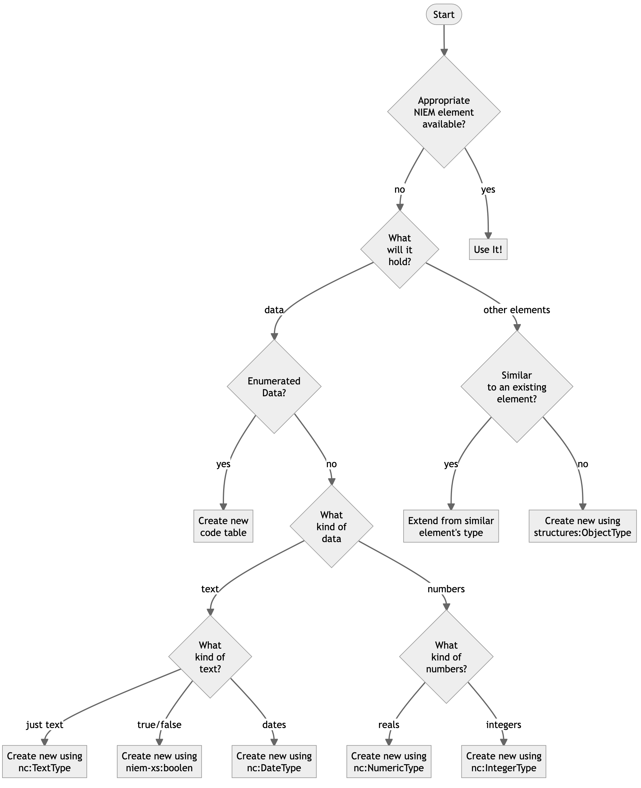

### Creating Simple Data Elements
- Base them on whichever XML Schema type is appropriate
- Follow the flowchart for help
- Base on the `niem-xs` adapters if you need referencing
	- Folks generally do this anyway, for consistency
- Follow the naming format of existing NIEM elements of that type, especially regarding the last term, e.g. “Text”, “Code”, etc.

**Create `PersonDefenestrationIndicator` using the existing NIEM type `niem-xs:boolean`. By giving it `j:CrashPersonAugmentationPoint` as a substitution group head, it can go inside of the `j:CrashPerson`.**

```xml
<xs:element name="PersonDefenestrationIndicator" type="niem-xs:boolean"
	substitutionGroup="j:CrashPersonAugmentationPoint">
	<xs:annotation>
		<xs:documentation>True if this person was thrown through a window; false otherwise.
		</xs:documentation>
	</xs:annotation>
</xs:element>
```
**The resulting XML instance is then:**

```xml
<j:CrashPerson>
	<nc:RoleOfPerson structures:ref="P01" xsi:nil="true"/>
	<j:CrashPersonInjury structures:metadata="PMD01 PMD02">
		<nc:InjuryDescriptionText>Broken Arm</nc:InjuryDescriptionText>
		<j:InjurySeverityCode>3</j:InjurySeverityCode>
	</j:CrashPersonInjury>
	<ext:PersonDefenestrationIndicator>false</ext:PersonDefenestrationIndicator>
</j:CrashPerson>
```
**And the equivalent JSON-LD is:**

```json
"j:CrashPerson": {
	"nc:RoleOfPerson": {
	  "@id": "#P01"
	},
	"j:CrashPersonInjury": {
	  "nc:InjuryDescriptionText": "Broken Arm",
	  "j:InjurySeverityCode": "3",
	  "ext:PrivacyCode": [
		"PII", "MEDICAL"
	  ]
	},
	"ext:PersonDefenestrationIndicator": "false"
}
```
Note the `@id` that links to an identical `@id` in the nc:Person object.

**For a more complicated example, we can create the `ext:PrivacyCode` element along with a `ext:PrivacyMetadata` to hold it.**

**The actual codes are defined in the simple type, `ext:PrivacyCodeSimpleType`. Each `enumeration` defines a code. The `documentation` tags provide a longer text description of the code.**

```xml
<xs:simpleType name="PrivacyCodeSimpleType">
	<xs:annotation>
		<xs:documentation>A data type for a code representing a kind of
			property.</xs:documentation>
	</xs:annotation>
	<xs:restriction base="xs:token">
		<xs:enumeration value="PII">
			<xs:annotation>
				<xs:documentation>Personally Identifiable Information</xs:documentation>
			</xs:annotation>
		</xs:enumeration>
		<xs:enumeration value="MEDICAL">
			<xs:annotation>
				<xs:documentation>Medical Information</xs:documentation>
			</xs:annotation>
		</xs:enumeration>
	</xs:restriction>
</xs:simpleType>

```

**The complex type `ext:PrivacyCodeType` is then extended from `ext:PrivacyCodeSimpleType`. All this does is add infrastructure attributes to allow things of this type to refer to other elements, or be referred to in turn.**

```xml
<xs:complexType name="PrivacyCodeType">
	<xs:annotation>
		<xs:documentation>A data type for a code representing a kind of
			property.</xs:documentation>
	</xs:annotation>
	<xs:simpleContent>
		<xs:extension base="ext:PrivacyCodeSimpleType">
			<xs:attributeGroup ref="structures:SimpleObjectAttributeGroup"/>
		</xs:extension>
	</xs:simpleContent>
</xs:complexType>
```
**Then `ext:PrivacyCode` is created to be of `ext:PrivacyCodeType`.**

```xml
<xs:element name="PrivacyCode" type="ext:PrivacyCodeType">
	<xs:annotation>
		<xs:documentation>A code representing a kind of property.</xs:documentation>
	</xs:annotation>
</xs:element>
```

**In this exchange, this code is metadata to be applied to other objects, so we can create `ext:PrivacyMetadata` to hold it.**

```xml
<xs:element name="PrivacyMetadata" type="ext:PrivacyMetadataType">
	<xs:annotation>
		<xs:documentation>Metadata about Privacy.</xs:documentation>
	</xs:annotation>
</xs:element>
<xs:complexType name="PrivacyMetadataType">
	<xs:annotation>
		<xs:documentation>A data type for metadata about Privacy.</xs:documentation>
	</xs:annotation>
	<xs:complexContent>
		<xs:extension base="structures:MetadataType">
			<xs:sequence>
				<xs:element ref="ext:PrivacyCode" minOccurs="0" maxOccurs="unbounded"/>
			</xs:sequence>
		</xs:extension>
	</xs:complexContent>
</xs:complexType>
```

**The resulting XML instance document is:**

```xml
<ext:PrivacyMetadata structures:id="PMD01">
	<ext:PrivacyCode>PII</ext:PrivacyCode>
</ext:PrivacyMetadata>
```

**An equivalent JSON document would be:**

Instead of linking to separate metadata objects, we've embedded those into the `j:CrashPeson`.

```json
"j:CrashPerson": {
	"nc:RoleOfPerson": {
	  "@id": "#P01"
	},
	"j:CrashPersonInjury": {
	  "nc:InjuryDescriptionText": "Broken Arm",
	  "j:InjurySeverityCode": "3",
	  "ext:PrivacyCode": [
		"PII", "MEDICAL"
	  ]
	},
	"ext:PersonDefenestrationIndicator": "false"
}
```

### Creating Complex Objects
- If you’re making a special kind of existing NIEM type:
	- Use that type as a base to extend from and add things to it, or
	- Create an Augmentation to hold your new things
- If you’re starting from scratch:
	- Use structures:ObjectType as a base to extend from and add things to it

**Here we're making the root element that will hold everything else. We create `CrashDriverInfoType`, basing it on `structures:ObjectType` so that it's just an empty object.**

**To that empty object, we add all the major objects in our exchange, `nc:Person`, `j:Crash`, and `j:Charge`. We also add a `j:PersonChargeAssociation` which lets us link together people and charges. Finally, we add a couple metadata object, the built-in `j:Metadata`, and `ext:PrivacyMetadata`, which we create in the extension schema and is in the prior example.**

```xml
<xs:element name="CrashDriverInfo" type="exch:CrashDriverInfoType">
	<xs:annotation>
		<xs:documentation>A collection of legal charges associated with the driver of a vehicle in a crash.</xs:documentation>
	</xs:annotation>
</xs:element>

<xs:complexType name="CrashDriverInfoType">
	<xs:annotation>
		<xs:documentation>A data type for a collection of legal charges associated with the driver of a vehicle in a crash.</xs:documentation>
	</xs:annotation>
	<xs:complexContent>
		<xs:extension base="structures:ObjectType">
			<xs:sequence>
				<xs:element ref="nc:Person" maxOccurs="unbounded"/>
				<xs:element ref="j:Crash"/>
				<xs:element ref="j:PersonChargeAssociation" minOccurs="0" maxOccurs="unbounded"/>
				<xs:element ref="j:Charge" minOccurs="0" maxOccurs="unbounded"/>
				<xs:element ref="j:Metadata" minOccurs="0"/>
				<xs:element ref="ext:PrivacyMetadata" minOccurs="0" maxOccurs="unbounded"/>
			</xs:sequence>
		</xs:extension>
	</xs:complexContent>
</xs:complexType>
```

## Creating and Validating Schemas
- Conformance
- How things fit together
- Subsets
- Extension and Exchange Schemas

### NIEM Conformance
- Follow the rules in the Naming and Design Rules (NDR)
- Follow the rules in the IEPD Spec
- Many NDR rules exist as Schematron
	- Can check these via the Conformance Testing Assistant (ConTesA)
	- Can run the Schematron directly oXygen, with a plug-in in XMLSpy

### How Schemas Fit Together

Step 1: Exchange Schema

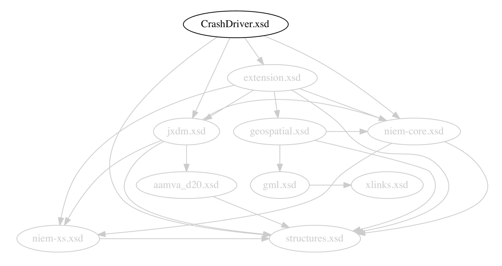

Step 2: Extension Schema

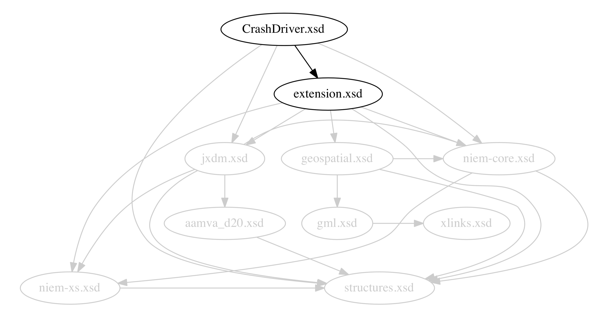

Step 3: NIEM Core

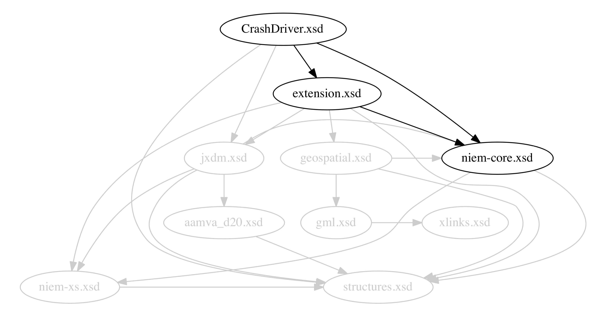

Step 4: Domains

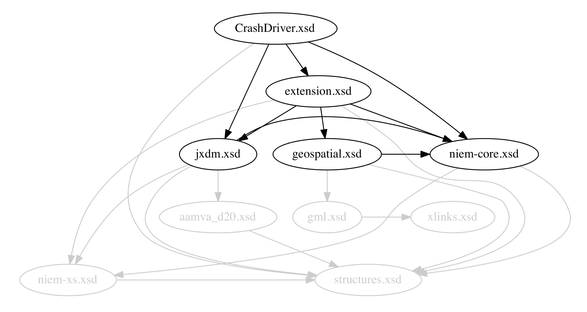

Step 5: Code Tables

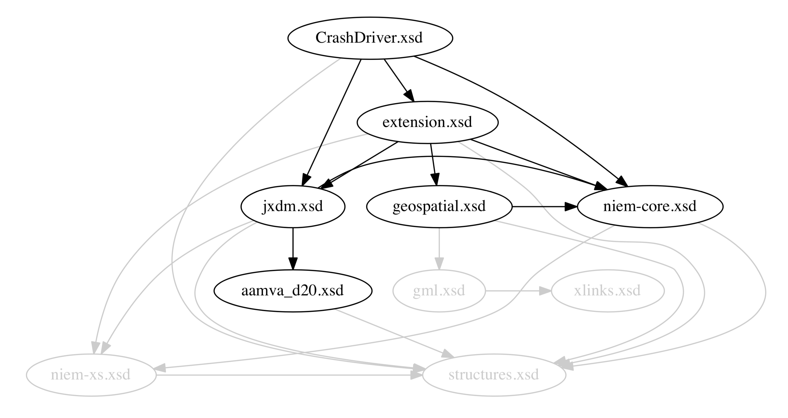

Step 6: External Standards

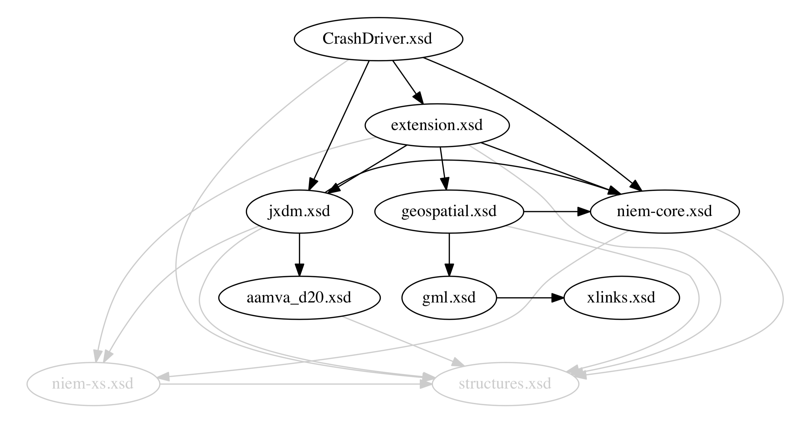

Step 7: Infrastructure


### Schema Subsets
- NIEM has ~14,000 elements
- You don’t want them all
- NIEM supports mini versions of NIEM
	- With the elements / types you want
	- Plus things needed to make the elements / types you want work
- Use the [SSGT](https://tools.niem.gov/niemtools/ssgt/index.iepd) for this!

### Extension Schema(s)
- Create new elements for your exchange
- Emulate how NIEM does it
- Utilize Augmentations to add your new objects to existing NIEM objects
	- Concrete extension is an alternative
- Can have multiple extension schemas
- Some folks put code tables into a separate extension schema

### Exchange Schema
- Entry point to the exchange
- Defines the root element of the exchange
- Some put the definition for the root element here
- Some put that in the extension schema
- Some lump exchange and extension together
- An exchange with multiple messages can have multiple exchange schemas, one per
	- Can share a common extension
	- Or not

### Help with Schemas
- Use a good XML editor
- Declare a conformance target
	- Just use the same one I am
- Declare and import all schemas used
	- Watch out for schemas incorporated only via substitution groups
	- Group heads don’t know who the members are
	- Still need to declare and import those

### Example Instances
- Required
- Validating against your schemas ensures your intent
- Some XML editors can create them from schemas
	- But you’ll always need to tweak those
- JSON instances are more of a manual process because NIEM doesn't support JSON Schema
	- It's in the works
- Other tools are out there…

### Tips and Tricks
- Christina’s oXygen Snippets
- Use Schematron to check your work as you go
- Tom’s BBEdit instance generation scripts
- Tom’s Mapping Spreadsheet Linter

### Other Artifacts
- IEPD Catalog
	- Metadata about the IEPD
	- What file is what
- Readme
- Changelog
- Conformance Assertion
- Mapping Spreadsheet
- Master Documentation

### Master Documentation
- Just a Word document
	- Or another document format, e.g. Markdown, PDF, etc.
- A NIEM IEPD master document should (at a minimum) describe:
	- IEPD purpose
	- scope
	- business value
	- exchange information
	- senders/receivers
	- interactions
	- references to other documentation, if applicable
- Don’t paste schemas into them!

### Message Spec / IEPD Assembly
- IEPDs are just ZIP files full of artifacts
- Can organize how you like
	- The IEPD Catalog is the guide to your organization
	- Generally, keep it simple
- MEP Builder will help with this (coming soon)

# Publishing
- Existing repositories are out of date
	- IEPD Clearinghouse
	- Work With IEPDs (currently not working)
- New repositories are coming
	- Restricted (coming soon)
	- Unrestricted (coming later)

# Implementation
- Remember that NIEM is just the payload
	- It’s just plain old XML
		- Well, okay, with referencing
	- Or it’s just plain JSON
		- Well, okay, with JSON-LD
- Remember the scope of NIEM
	- Things outside the payload aren't NIEM
	- You don’t have to do anything special for NIEM outside NIEM’s scope

## Skill level to Implement NIEM
- Developers with the skills to design and implement a data exchange can learn the NIEM approach in a matter of hours
- Developer training is available
	- No-cost online courses are on the NIEM website
- Plenty of example IEPDs to follow
- Don’t start from scratch, leverage shared IEPDs
- The NIEM technical specifications are complex, however
	- Most developers do not need to read them
	- Free tools can perform most of the conformance checking

# Exercises
   

For Inherited Properties, use j:CommercialVehicle

# Resources

## Documentation

- NIEM Releases
	- [http://niem.github.io/niem-releases/](http://niem.github.io/niem-releases/)
- NIEM Specifications
	- [http://niem.github.io/reference/specifications/](http://niem.github.io/reference/specifications/)
- Materials from this course:
	- [https://github.com/NIEM/NIEM-Training](https://github.com/NIEM/NIEM-Training)
	- These are internal work products

## Tools
- SSGT:
	- [https://tools.niem.gov/niemtools/ssgt/index.iepd](https://tools.niem.gov/niemtools/ssgt/index.iepd)
- Conformance Testing Assistant (ConTesA)
	- [https://tools.niem.gov/contesa/](https://tools.niem.gov/contesa/)
- NDR Schematron
	- [https://niem.github.io/reference/tools/oxygen/ndr/](https://niem.github.io/reference/tools/oxygen/ndr/)
- MEP Builder (coming soon)
- Wayfarer:
	- [http://niem5.org/wayfarer/](http://niem5.org/wayfarer/)
- oXygen Snippets
	- [https://niem.github.io/reference/tools/oxygen/snippets/](https://niem.github.io/reference/tools/oxygen/snippets/)
- Mapping Spreadsheet Linter / Schema Generator
	- [http://niem5.org/linter/](http://niem5.org/linter/)
- Instance generation scripts (coming soon)

## Repositories
- IEPD Clearinghouse
	- [https://bja.ojp.gov/program/it/policy-implementation/clearinghouse](https://bja.ojp.gov/program/it/policy-implementation/clearinghouse)
- IEPD Repository (Work with IEPDs)
	- [https://tools.niem.gov/niemtools/iepdt/index.iepd](https://tools.niem.gov/niemtools/iepdt/index.iepd)

