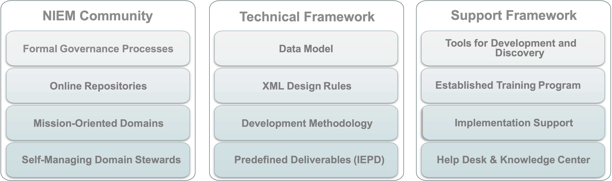
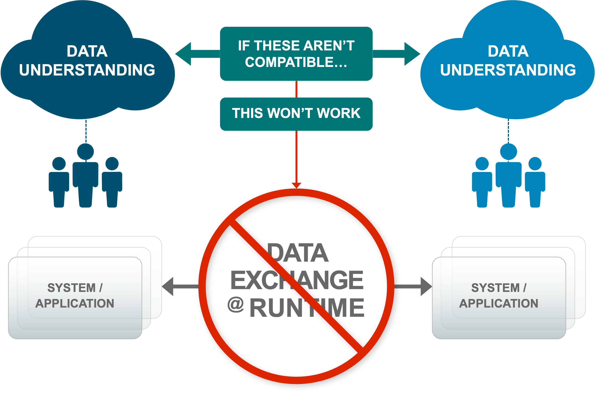
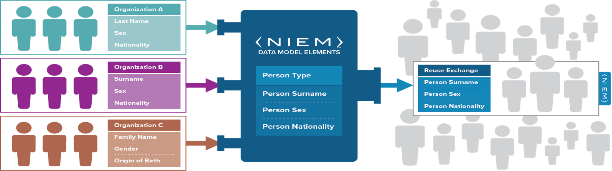

# Master NIEM Training Document

# Introduction

## Purpose

A technical webinar focused on developers and implementers who are interested in a deep-dive of the National Information Exchange Model.

## Agenda

- Logistics
- Introduction to NIEM
- Introduction to IEPD Development
	- Scenario Planning
	- Requirements Analysis
	- Mapping
		- Intro to Mapping
		- Mapping to Existing Objects
		- Creating New Objects
		- External Standards
	- Creating and Validating Schemas
	- Assembly
	- Publishing
	- Implementation
- Resources

## Logistics

- Three days, 1-4pm each day
- Short breaks on the hour
- Ask questions via chat when you have them
	- Someone is monitoring chat
- This document and supporting materials at:
	- https://github.com/niem/niem-training

## Introduction to NIEM

- What is NIEM?
- The Scope of NIEM
- NIEM Harmonization and Organization

### What is NIEM? - Framework
- NIEM is a community-driven, government and jurisdiction-wide, standards-based approach to exchanging information
- Diverse communities can collectively leverage NIEM to increase efficiencies and improve decision-making
- NIEM is available to everyone, including public and private organizations
- NIEM includes a data model, governance, training, tools, technical support services, and an active community to assist users in adopting a standards-based approach to exchanging data

### What is NIEM? – Interop Problem
- If we don’t understand what each other means, we won’t be able to exchange info
- Need a common language for defining things

### What is NIEM? And what not?
**NIEM is:**
- a common vocabulary
- a means of enabling efficient information exchange across diverse public and private - organizations

**NIEM is not:**
- a system or database
- a means of specifying how to transmit or store data
___
### What is NIEM? – Exchanging Data and Components
- Using NIEM, organizations come together to agree on a common vocabulary
- When additional organizations are added to the information exchange, the initial NIEM exchange can be reused, saving time and money

