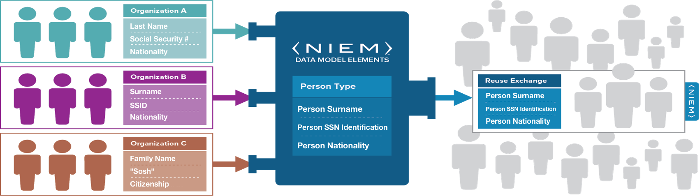
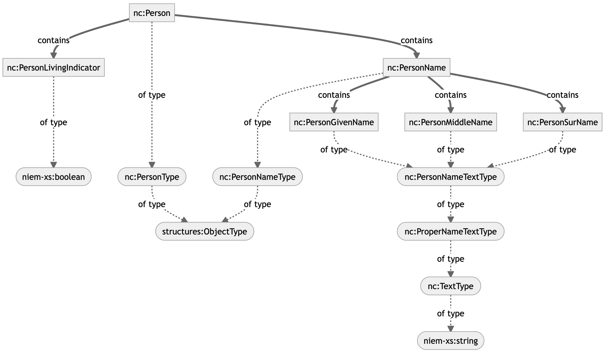

# Master NIEM Training Document
NIEM Training

Tom Carlson, GTRI
Thomas.Carlson@gtri.gatech.edu

# Introduction

## Purpose

A technical webinar focused on developers and implementers who are interested in a deep-dive of the National Information Exchange Model.

## Supporting Documents

All materials are available on the NIEM Training Github repo at [https://github.com/NIEM/NIEM-Training](https://github.com/NIEM/NIEM-Training). Specific materials used are listed on the README page and include:

- [NIEM Training Syllabus](https://github.com/NIEM/NIEM-Training/blob/main/NIEM%20Training%20Syllabus.md)
- [**Master NIEM Training Document**](https://github.com/NIEM/NIEM-Training/blob/main/Master%20NIEM%20Document/Master%20NIEM%20Training%20Document.md)
- [Mapping Spreadsheets](https://github.com/NIEM/NIEM-Training/tree/main/Master%20NIEM%20Document/Mapping_Spreadsheets)
- [Ersatz Textual Instances](https://github.com/NIEM/NIEM-Training/tree/main/Master%20NIEM%20Document/Text_Document)

## Sample Message Specification

- [Crash Driver Message Specification](https://github.com/NIEM/NIEM-Training/tree/main/Crash%20Driver%20IEPD)

## Agenda

- Logistics
- Introduction to NIEM
- Introduction to Message Spec / IEPD Development
	- Scenario Planning
	- Requirements Analysis
	- Mapping
		- Intro to Mapping
		- Mapping to Existing Objects
		- Creating New Objects
		- External Standards
	- Creating and Validating Schemas
	- Assembly
	- Publishing
	- Implementation
- Exercises
- Resources
___
## Logistics and Background

- Major revamp of prior training programs
- Three days, 1-5pm each day
- Short breaks on the hour
- Ask questions via chat _when you have them_
	- Someone is monitoring chat and will interrupt me as needed
- This document and supporting materials are at:
	- https://github.com/niem/niem-training
___
## Introduction to NIEM

- What is NIEM?
- The Scope of NIEM
- NIEM Harmonization and Organization
___
### What is NIEM? - Framework
- NIEM is a community-driven, government and jurisdiction-wide, standards-based approach to exchanging information
- Diverse communities can collectively leverage NIEM to increase efficiencies and improve decision-making
- NIEM is available to everyone, including public and private organizations
- NIEM includes a data model, governance, training, tools, technical support services, and an active community to assist users in adopting a standards-based approach to exchanging data


___
### What is NIEM? – Interop Problem
- If we don’t understand what each other means, we won’t be able to exchange info
- Need a common language for defining things


___
### What is NIEM? And what not?
**NIEM is:**
- a common vocabulary
- a means of enabling efficient information exchange across diverse public and private organizations

**NIEM is not:**
- a system or database
- a means of specifying how to transmit or store data
___
### What is NIEM? – Exchanging Data and Components
- Using NIEM, organizations come together to agree on a common vocabulary
- When additional organizations are added to the information exchange, the initial NIEM exchange can be reused, saving time and money


___
### What is NIEM? – Simplified Exchanges
- When using NIEM, you only need to “speak” two languages: your own and NIEM

| Without NIEM | With NIEM |
| --- | --- |
|||
___
### Scope of NIEM
- NIEM is a data layer standard and intentionally does not address all the necessary technologies needed for information sharing
- Exchange partners decide how to store and process the NIEM-conformant data being exchanged


___
### Scope of NIEM - Open Source Interconnection (OSI) model

**Detailed:**


**Simplified:**


___
### Bottle of Liquid
**A bottle of liquid:**

|  |  |
| --- | --- |
| Has some combination of liquids inside | NIEM is the liquid inside, the payload document |
| Has a shape | NIEM doesn’t care about the shape |
| Made of certain materials | NIEM doesn’t care about what the bottle is made out of or how it's constructed |
| Can be opaque or transparent | NIEM doesn’t care about whether you can see into the bottle |
| Is moved around by various means | NIEM doesn’t care about how you move the bottle around |
| Can be filled and emptied | NIEM doesn’t care about how you filled it or what you do with the liquid later |

___
### NIEM Harmonization and Organization

- Think of the NIEM data model as a mature and stable data dictionary of agreed-upon terms, definitions, relationships, and formats independent of how information is stored in individual agency systems
- The data model consists of two sets of closely related vocabularies:
	- NIEM core
	- Individual NIEM domains
- NIEM core includes data elements commonly agreed upon across all NIEM domains (i.e., person, activity, location, and item, etc.)
- Individual NIEM domains contain mission-specific data components that build upon NIEM core concepts


| Existing Domains                              | Upcoming Domains             |
| --------------------------------------------- | ---------------------------- |
| Agriculture                                   | Learning and Development     |
| Biometrics                                    | International Human Services |
| Chemical, Biological, Radiological, & Nuclear |                              |
| Cyber (new in 5.1)                            |                              |
| Emergency Management                          |                              |
| Human Services                                |                              |
| Immigration                                   |                              |
| Infrastructure Protection                     |                              |
| Intelligence                                  |                              |
| International Trade                           |                              |
| Justice                                       |                              |
| Maritime                                      |                              |
| Military Operations                           |                              |
| Screening                                     |                              |
| Surface Transportation                        |                              |

**Domains hold objects specific to their domains:**

| Agriculture | Biometrics |
| --- | --- |
|  |  |

| Chemical, Biological, Radiological, & Nuclear | Emergency Management |
| --- | --- |
|  |  |

| Human Services | Immigration |
| --- | --- |
|  |  |

| Infrastructure Protection | Intelligence |
| --- | --- |
|  |  |

| International Trade | Justice |
| --- | --- |
|  |  |

| Maritime | Military Operations |
| --- | --- |
|  |  |

| Screening  | Surface Transportation |
| --- | --- |
|  |  |


**NIEM Versioning**

- NIEM has major and minor versions, plus domain updates
- Major version releases, e.g. 4.2 to 5.0
	- Every 3 years
	- All bets are off
	- NIEM-Core can and will change
		- Underlying infrastructure can also change
	- Domains can change
	- Domains are harmonized
		- Combination of tools and human collaboration to reach consensus
		- Repeated content is collapsed
		- Misplaced content is moved, either to other domains or to core
		- New content is added
	- _Nothing_ in a major version change is guaranteed to be backwards compatible with earlier major releases
	- NIEM 6.0 scheduled for end of 2023
- Minor version releases, e.g. 5.0 to 5.1:
	- Annually
	- **NIEM-Core does not change!**
		- **Neither does the underlying infrastructure**
	- Domains can change
	- Domains can be harmonized
	- Domains can be added, like Cyber in 5.1
	- Domains are not guaranteed to be backwards compatible with earlier minor releases
		- But they often are
	- NIEM 5.2 scheduled for end of 2022
- Domain updates are done per-domain
	- Domains can update their content in between minor releases
	- Those updates then are normally folded into the next minor release
- Older versions never go away
	- You can still use NIEM 1.0 (but shouldn't)
	- There are plenty of NIEM 2.0 exchanges in current use
- Migration
	- Don't have to migrate
	- May want to migrate if a newer version gives you functionality you need (and you're already making changes)
	- NIEM provides tools for migrating the NIEM objects, ~90% effective
	- Manual work is needed for things you've added for your exchange

**NIEM Administration Organization**


___

# Message Spec / IEPD Overview
- "Information Exchange Package Documentation"
- Slowly changing to "Message Specification"
- Defines an exchange
- Made up of a bunch of documents, "artifacts"
	- Some meant for humans
	- Some meant for computers
___
## Message Spec Process
Creating a Message Spec is a multi-step process:

1. Scenario Planning
2. Analyze Requirements
3. Map and Model
4. Build and Validate
5. Assemble and Document (and Publish) 
6. Implement


Each step produces artifacts used by subsequent steps:

1. A clue as to what you're doing...
2. UML Diagrams
3. Mapping Spreadsheet
4. Schemas and Instance Documents
5. Textual Documents
6. Code


**Message Spec / IEPD Process – Idealized**


**Message Spec / IEPD Process – Real Life**


___
### Message Spec / IEPD Artifacts - Documentation

- Master Documentation (Word)
- Message Spec / IEPD catalog document (`iepd-catalog.xml`)
- Change log (text)
- README (text)
- Conformance assertion (text)

___
### Message Spec / IEPD Artifacts - Definitional

- Wantlist (`wantlist.xml`)
- Schema subset schemas
- Extension schemas
- Exchange schemas
- Sample instances
- XML catalogs

___

## Scenario Planning

- Decide what the exchange is about
- Who are the exchange partners?
- Who are stakeholders?
- Communication is key


- Existing exchanges or other documentation can help
	- Within your organization
	- From NIEM repositories (_huge caveat_)
	- There's a community to draw from


___
### Existing Documentation

- Current technical architecture documents of all exchange partners
- Stakeholders that will be involved in the exchange
- Security, privacy, and other policy-related concerns associated with the exchange
- Technical characteristics of the exchange:
	- Types of data being shared
	- Number of data objects
		- Current structure of the data (logical, physical)
		- Use of external standards
___


## Analyze Requirements
- Diagrams
	- Use Case Diagrams
	- Business Process Diagrams
	- Sequence Diagrams
- Class Diagrams
- Spreadsheets
- Other documents

**Use Case Diagrams**


**Business Process Diagrams**


**Sequence Diagrams**


___
### UML Class Diagrams

- The bread and butter of Message Spec / IEPD business requirements
- Can be oriented towards business terms and objects
	- Better for consensus
- Can be oriented towards NIEM terms and objects
	- Pre-loads the mapping step
___
### Business Oriented Class Diagram

Representing objects in UML by their business names and relationships.


___
### NIEM Oriented Class Diagram


___
### UML Tools
- [ArgoUML](https://en.wikipedia.org/wiki/ArgoUML)
- [BOUML](https://en.wikipedia.org/wiki/BOUML)
- [MagicDraw](https://en.wikipedia.org/wiki/MagicDraw) / [Rational Rose](https://en.wikipedia.org/wiki/IBM_Rational_Rose_XDE) (\$\$\$)
- [Visio](https://en.wikipedia.org/wiki/Microsoft_Visio) / [OmniGraffle](https://en.wikipedia.org/wiki/OmniGraffle)
- [Graphviz](https://graphviz.org/) / [Mermaid](https://mermaid-js.github.io/mermaid/) / [PlantUML](https://plantuml.com/)
- Many more…
___
### Business Rules
- Some rules are _not_ easily represented in UML
- You can use whatever works for your needs
- Schematron for XML
	- e.g. Birth dates must be in the past, salutations matching gender
- Plain old textual descriptions are great!
___
### The Process from Here On…

We have choices on how to proceed:

- Step-by-step
	- Finish mapping entirely before starting schemas
- Concurrent
	- Building schemas and instances as you go
- We'll use something in-between
	- Build an ersatz matching instance document as we map ([[12 Crash Driver Report Complete]])
	- Sorta like YAML without data values
	- Save schemas for the end

(Will use a super secret tool to help with some of this!)

## XML Schema in a Nutshell

XML Schema defines what an XML document needs to look like. (JSON Schema does the same for JSON documents.)

For example, this bit of XML Schema defines what a `PersonName` object needs to look like.

```xml
<xs:complexType name="PersonNameType">
	<xs:annotation>
		<xs:documentation>A data type for a combination of names and/or titles by which a person is known.</xs:documentation>
	</xs:annotation>
	<xs:sequence>
		<xs:element name="PersonGivenName" type="xs:string" minOccurs="1" maxOccurs="1"/>
		<xs:element name="PersonMiddleName" type="xs:string" minOccurs="0" maxOccurs="unbounded"/>
		<xs:element name="PersonSurName" type="xs:string" minOccurs="1" maxOccurs="1"/>
	</xs:sequence>
	<xs:attribute name="personNameCommentText" type="xs:string" use="optional"/>
</xs:complexType>

<xs:element name="PersonName" type="PersonNameType" nillable="true">
	<xs:annotation>
		<xs:documentation>A combination of names and/or titles by which a person is known.</xs:documentation>
	</xs:annotation>
</xs:element>

```
And here's what the matching XML _instance_ document might look like.

```xml
	<PersonName personNameCommentText="copied">
		<PersonGivenName>Peter</PersonGivenName>
		<PersonMiddleName>Death</PersonMiddleName>
		<PersonMiddleName>Bredon</PersonMiddleName>
		<PersonSurName>Wimsey</PersonSurName>
	</PersonName>
```

We will see much more of this. This is just an initial glance at it.
___


## Map and Model
For this entire section, we'll look at various things in the mapping spreadsheet and show how to map them to NIEM or to new elements that we'll create later. As we move through, we'll cover all the major aspects of how NIEM works.
___
### Introduction to Mapping
- Mapping Spreadsheets Options
	- NIEM Mapping Template
	- Simple Training Spreadsheet
	- Something In-between
- Document Business Objects
- Map them to NIEM objects, existing or new
- Maintaining an Ongoing Sample Instance Skeleton
___
### NIEM Mapping Template
- Primarily for submitting content for inclusion in NIEM
	- Eight different tabs
- Can also be used for mapping in a Message Spec / IEPD
	- Just need a few of the tabs, mainly
- Is a bit overkill for a Message Spec
- Slight difference between the versions on the NIEM site and for use with MEP Builder
- [[Mapping_Spreadsheets/niem-mapping-template.xlsx]]
___
### Simple Training Spreadsheet
- Minimal
- Designed to be simple enough to fit on slides
	- No, really, that’s the constraint
- Usually expanded in practice


___
### Tom’s Custom Mapping Spreadsheet
- Has evolved over time
- Contains all the info needed to make schemas
- Not as overwhelming as the NIEM Mapping Template
- Works with the NIEM Linter
- You can make your own custom one
	- The IEPD Spec doesn’t specify a required format, by design
- Fresh copy for our example Message Spec / IEPD
	- [[Mapping_Spreadsheets/00 Crash Driver Report Fresh.numbers]]
	- [[Mapping_Spreadsheets/00 Crash Driver Report Fresh.xlsx]]
	- [[Mapping_Spreadsheets/00 Crash Driver Report Fresh.pdf]]
- Check on the cardinality
	- Why is Person 1..1?
	- Because this is a report on a Crash Driver, not the Crash itself
		- So the driver is the only person
		- Could simplify this Message Spec with some assumptions
		- But that would leave us with too little to do in class
	- A different context would have different cardinality
		- Likely multiple Person objects

___
### Basics of Searching NIEM

**Tools**

- [SSGT](https://tools.niem.gov/niemtools/ssgt/index.iepd)
- [Wayfarer](http://niem5.org/wayfarer/)
- NIEM Schemas
	- [Official Releases](https://niem.github.io/niem-releases/)
	- [HyperNIEM](http://niem5.org/schemas/)
- Spreadsheet (included in the official releases)

**Techniques**

- Search for Terms
	- Simple vs Advanced
- Search for Synonyms
- Search for Word Roots
- Search for Containers
- Search for Properties

___
# Mapping and NIEM Technical Details

## Understanding NIEM Objects
- XML Schema uses elements and types
- What an element can hold is based on its type
- What you are (your type) defines what you can hold



### XML Schema

The XML Schema defining [`nc:Person`](http://niem5.org/schemas/nc.html#Person) includes a definition and a type.

Its type, [`nc:PersonType`](http://niem5.org/schemas/nc.html#PersonType), has a little more information. It also includes a definition, one similar to `nc:Person`. It also includes a `base` that tells us what sort of thing it is. In this case, the base is `structures:ObjectType`, which is just an empty object (that has a few infrastructure pieces we'll learn about later). To that `base` it adds several objects. These are objects that go _inside_ an `nc:Person` object. Each one is a reference to a declaration of each of those objects. Each also has cardinality defined, which tells us how many of each can go inside of an `nc:Person`. `minOccurs` is the minimum number of times. Any non-negative integer can go here, but 0 and 1 are what you'll usually find. Zero essentially means "optional." `maxOccurs` is the maximum number of times. This can also be any non-negative number, but can also be "unbounded", which means "as many as you want." Typical values are 1 and unbounded. Here's the schema for `nc:PersonType` with some of the contained objects removed for clarity:

```xml
<xs:complexType name="PersonType">
	<xs:annotation>
		<xs:documentation>A data type for a human being.</xs:documentation>
	</xs:annotation>
	<xs:complexContent>
		<xs:extension base="structures:ObjectType">
			<xs:sequence>
				<xs:element ref="nc:PersonAccentText" minOccurs="0" maxOccurs="unbounded"/>
				<xs:element ref="nc:PersonAgeDescriptionText" minOccurs="0" maxOccurs="unbounded"/>
				<!-- A whole slew of objects removed for clarity -->
				<xs:element ref="nc:PersonLivingIndicator" minOccurs="0" maxOccurs="unbounded"/>
				<!-- A whole slew of objects removed for clarity -->
				<xs:element ref="nc:PersonName" minOccurs="0" maxOccurs="unbounded"/>
				<!-- A whole slew of objects removed for clarity -->
				<xs:element ref="nc:PersonHomeContactInformation" minOccurs="0" maxOccurs="unbounded"/>
				<xs:element ref="nc:PersonAugmentationPoint" minOccurs="0" maxOccurs="unbounded"/>
			</xs:sequence>
		</xs:extension>
	</xs:complexContent>
</xs:complexType>

<xs:element name="Person" type="nc:PersonType" nillable="true">
	<xs:annotation>
		<xs:documentation>A human being.</xs:documentation>
	</xs:annotation>
</xs:element>

```

The XML Schema defining [`nc:PersonName`](http://niem5.org/schemas/nc.html#PersonName) and [`nc:PersonNameType`](http://niem5.org/schemas/nc.html#PersonNameType) looks like:

```xml
<xs:complexType name="PersonNameType">
	<xs:annotation>
		<xs:documentation>A data type for a combination of names and/or titles by which a person is known.</xs:documentation>
	</xs:annotation>
	<xs:complexContent>
		<xs:extension base="structures:ObjectType">
			<xs:sequence>
				<xs:element ref="nc:PersonNamePrefixAbstract" minOccurs="0" maxOccurs="unbounded"/>
				<xs:element ref="nc:PersonGivenName" minOccurs="0" maxOccurs="unbounded"/>
				<xs:element ref="nc:PersonMiddleName" minOccurs="0" maxOccurs="unbounded"/>
				<xs:element ref="nc:PersonSurName" minOccurs="0" maxOccurs="unbounded"/>
				<xs:element ref="nc:PersonNameSuffixText" minOccurs="0" maxOccurs="unbounded"/>
				<xs:element ref="nc:PersonMaidenName" minOccurs="0" maxOccurs="unbounded"/>
				<xs:element ref="nc:PersonFullName" minOccurs="0" maxOccurs="unbounded"/>
				<xs:element ref="nc:PersonNameCategoryAbstract" minOccurs="0" maxOccurs="unbounded"/>
				<xs:element ref="nc:PersonNameSalutationText" minOccurs="0" maxOccurs="unbounded"/>
				<xs:element ref="nc:PersonOfficialGivenName" minOccurs="0" maxOccurs="unbounded"/>
				<xs:element ref="nc:PersonPreferredName" minOccurs="0" maxOccurs="unbounded"/>
				<xs:element ref="nc:PersonSurNamePrefixText" minOccurs="0" maxOccurs="unbounded"/>
				<xs:element ref="nc:EffectiveDate" minOccurs="0" maxOccurs="unbounded"/>
				<xs:element ref="nc:PersonNameAugmentationPoint" minOccurs="0" maxOccurs="unbounded"/>
			</xs:sequence>
			<xs:attribute ref="nc:personNameCommentText" use="optional"/>
		</xs:extension>
	</xs:complexContent>
</xs:complexType>

<xs:element name="PersonName" type="nc:PersonNameType" nillable="true">
	<xs:annotation>
		<xs:documentation>A combination of names and/or titles by which a person is known.</xs:documentation>
	</xs:annotation>
</xs:element>

```

The XML Schema defining [`nc:PersonGivenName`](http://niem5.org/schemas/nc.html#PersonGivenName), [`PersonNameTextType`](http://niem5.org/schemas/nc.html#PersonNameTextType), and supporting types looks like:

```xml
<xs:complexType name="PersonNameTextType">
	<xs:annotation>
		<xs:documentation>A data type for a name by which a person is known, referred, or addressed.</xs:documentation>
	</xs:annotation>
	<xs:simpleContent>
		<xs:extension base="nc:ProperNameTextType">
			<xs:attribute ref="nc:personNameInitialIndicator" use="optional"/>
		</xs:extension>
	</xs:simpleContent>
</xs:complexType>

<xs:complexType name="ProperNameTextType">
	<xs:annotation>
		<xs:documentation>A data type for a word or phrase by which a person or thing is known, referred, or addressed.</xs:documentation>
	</xs:annotation>
	<xs:simpleContent>
		<xs:extension base="nc:TextType"/>
	</xs:simpleContent>
</xs:complexType>

<xs:complexType name="TextType">
	<xs:annotation>
		<xs:documentation>A data type for a character string.</xs:documentation>
	</xs:annotation>
	<xs:simpleContent>
		<xs:extension base="niem-xs:string">
			<xs:attribute ref="nc:partialIndicator" use="optional"/>
			<xs:attribute ref="nc:truncationIndicator" use="optional"/>
			<xs:attribute ref="xml:lang" use="optional"/>
		</xs:extension>
	</xs:simpleContent>
</xs:complexType>

<xs:element name="PersonGivenName" type="nc:PersonNameTextType" nillable="true">
	<xs:annotation>
		<xs:documentation>A first name of a person.</xs:documentation>
	</xs:annotation>
</xs:element>

```
Finally, the definition for `nc:PersonLivingIndicator` is very simple. It's a boolean value, `true` or `false`.

```xml
<xs:element name="PersonLivingIndicator" type="niem-xs:boolean" nillable="true">
	<xs:annotation>
		<xs:documentation>True if a person is alive; false if a person is dead.</xs:documentation>
	</xs:annotation>
</xs:element>
```

The resulting instance document that all this creates might look like this:

```xml
<nc:Person>
	<nc:PersonLivingIndicator>false</nc:PersonLivingIndicator>
	<nc:PersonName nc:personNameCommentText="copied">
		<nc:PersonGivenName>Peter</nc:PersonGivenName>
		<nc:PersonMiddleName>Death</nc:PersonMiddleName>
		<nc:PersonMiddleName>Bredon</nc:PersonMiddleName>
		<nc:PersonSurName>Wimsey</nc:PersonSurName>
	</nc:PersonName>
</nc:Person>
```

(Who is [Peter Wimsey](https://en.wikipedia.org/wiki/Lord_Peter_Wimsey)?)
___
### What About JSON?

NIEM can be used with JSON via [JSON-LD](https://en.wikipedia.org/wiki/JSON-LD). JSON-LD extends JSON to allow for meaningfully linking data together. NIEM leverages JSON-LD in two ways:

1. NIEM uses `@context` to provide a mapping from JSON object names back to their counterparts in NIEM
2. NIEM uses `@id` to provide links between JSON objects

Linking is a topic for later in the class, but here is an example of the `@context`. This context tells us that `nc:Person` refers to the `Person` object in the NIEM-Core namespace.

```json
{
	"@context": {
		"nc": "http://release.niem.gov/niem/niem-core/5.0/#"
	},
	"nc:Person": {
		"nc:PersonLivingIndicator": "false",
		"nc:PersonName": {
			"nc:personNameCommentText": "copied",
			"nc:PersonGivenName": "Peter",
			"nc:PersonSurName": "Wimsey"
		}
	}
}

```
There are other means to shorten long NIEM names into names more amenable to JSON developers via [normalization](https://github.com/TomCarlson-NTAC/NIEM-JSON-Spec/wiki), but that topic is outside the scope of the training.

Note that the structure of the JSON mirrors the structure of the XML. NIEM with JSON does require mirroring the structure.

JSON-LD and JSON Schema are separate concepts. NIEM does not _yet_ support JSON Schema, although efforts are underway to enable that. Currently, JSON with NIEM is all about the JSON instance documents. NIEM itself is still defined in XML Schema.

Throughout the training, matching JSON instances will be included with XML instances.

___
## Native Properties

![[01 Native Properties - CrashDriverClassDiagram.png]]

- Some things will be easy to find
- Will map directly to NIEM objects
- Examples:
	- `nc:Person`, `nc:PersonName`, `nc:PersonGivenName`, etc.
	- Search for `nc:Person` in the [SSGT](http://niem5.org/ssgt_redirect.php?query=person)
	- Search for `nc:Person` in [Wayfarer](http://niem5.org/wayfarer/search.php?option=exact&query=person)

We've already seen the schema for these in detail.

### Artifacts

- [[01 Native Properties]]
- Mapping Spreadsheets
	- [[Mapping_Spreadsheets/01 Native Properties.numbers]]
	- [[Mapping_Spreadsheets/01 Native Properties.xlsx]]
	- [[Mapping_Spreadsheets/01 Native Properties.pdf]]

___
## Substitution Groups

![[02 Substitution Groups - CrashDriverClassDiagram.png]]

- Some concepts can be represented multiple ways
- Text / code combinations are common
- Date can be a date, datetime, or a range
- NIEM uses substitution groups to support both:
	- The single concept, and
	- Multiple representations of that concept
- Examples:
	- `nc:PersonBirthDate` ([SSGT](https://tools.niem.gov/niemtools/ssgt/SSGT-GetProperty.iepd?propertyKey=o4-11r)/[Wayfarer](http://niem5.org/wayfarer/nc/PersonBirthDate.html)) contains a `nc:DateRepresentation` ([SSGT](https://tools.niem.gov/niemtools/ssgt/SSGT-GetProperty.iepd?propertyKey=o4-92a)/[Wayfarer](http://niem5.org/wayfarer/nc/DateRepresentation.html))
	- Substitution group heads follow the form of: `SomethingRepresentation` or `WhateverAbstract`

### Schemas

Here we see [`nc:PersonBirthDate`](http://niem5.org/schemas/nc.html#PersonBirthDate) and its type, `nc:DateType`:

```xml
<xs:element name="PersonBirthDate" type="nc:DateType" nillable="true">
	<xs:annotation>
		<xs:documentation>A date a person was born.</xs:documentation>
	</xs:annotation>
</xs:element>
```

[`nc:DateType`](http://niem5.org/schemas/nc.html#DateType) contains `nc:DateRepresentation`, along with other date properties:

```xml
<xs:complexType name="DateType">
	<xs:annotation>
		<xs:documentation>A data type for a calendar date.</xs:documentation>
	</xs:annotation>
	<xs:complexContent>
		<xs:extension base="structures:ObjectType">
			<xs:sequence>
				<xs:element ref="nc:DateRepresentation" minOccurs="0" maxOccurs="unbounded"/>
				<xs:element ref="nc:DateAccuracyAbstract" minOccurs="0" maxOccurs="1"/>
				<xs:element ref="nc:DateMarginOfErrorDuration" minOccurs="0" maxOccurs="1"/>
				<xs:element ref="nc:DateAugmentationPoint" minOccurs="0" maxOccurs="unbounded"/>
			</xs:sequence>
		</xs:extension>
	</xs:complexContent>
</xs:complexType>
```
[`nc:DateRepresentation`](http://niem5.org/schemas/nc.html#DateRepresentation) is _abstract_, meaning it has no type and must be substituted with another object:

```xml
<xs:element name="DateRepresentation" abstract="true">
	<xs:annotation>
		<xs:documentation>A data concept for a representation of a date.</xs:documentation>
	</xs:annotation>
</xs:element>
```
Those other objects are identified by having a `substitutionGroup` attribute set to the name of the substitution group head. The most common one you'll see for `nc:DateRepresentation` is [`nc:Date`](http://niem5.org/schemas/nc.html#Date):

```xml
<xs:element name="Date" type="niem-xs:date" substitutionGroup="nc:DateRepresentation" nillable="true">
	<xs:annotation>
		<xs:documentation>A full date.</xs:documentation>
	</xs:annotation>
</xs:element>
```

### Instance Documents

In the resulting instance document, you don't see `nc:DateRepresentation` at all. You just see `nc:Date`, which is taking its place:

```xml
<nc:Person>
	<nc:PersonBirthDate>
		<nc:Date>1890-05-04</nc:Date>
	</nc:PersonBirthDate>
	<nc:PersonName>
		<nc:PersonGivenName>Peter</nc:PersonGivenName>
		<nc:PersonMiddleName>Death</nc:PersonMiddleName>
		<nc:PersonMiddleName>Bredon</nc:PersonMiddleName>
		<nc:PersonSurName>Wimsey</nc:PersonSurName>
	</nc:PersonName>
</nc:Person>
```
The matching JSON similarly just shows `nc:Date`:

```json
"nc:Person": {
	"nc:PersonBirthDate": {
		"nc:Date": "1890-05-04"
	},
	"nc:PersonName": {
		"nc:PersonGivenName": "Peter",
		"nc:PersonMiddleName": [
			"Death",
			"Bredon"
		],
		"nc:PersonSurName": "Wimsey"
	}
}
```

### Artifacts

- [[02 Substitution Groups]]
- Mapping Spreadsheets
	- [[Mapping_Spreadsheets/02 Substitution Groups.numbers]]
	- [[Mapping_Spreadsheets/02 Substitution Groups.xlsx]]
	- [[Mapping_Spreadsheets/02 Substitution Groups.pdf]]

___

## An aside about Namespaces

Below you can see object with different prefixes, `j:Crash` and `nc:ActivityDate`. The `j` and `nc` refer to different namespaces in XML Schema.

- Namespaces organize elements by context
- Identified by prefix, a nickname for the namespace
- NIEM governance is organized along these lines


```xml
<xs:schema targetNamespace="http://training.niem.gov/CrashDriver/1.0/extension" version="1" xml:lang="en-US"  
    xmlns:ext="http://training.niem.gov/CrashDriver/1.0/extension"  
    xmlns:j="http://release.niem.gov/niem/domains/jxdm/7.0/"  
    xmlns:nc="http://release.niem.gov/niem/niem-core/5.0/">

    <xs:import schemaLocation="../niem/domains/jxdm.xsd"  
        namespace="http://release.niem.gov/niem/domains/jxdm/7.0/"/>
	<xs:import schemaLocation="../niem/niem-core.xsd"  
        namespace="http://release.niem.gov/niem/niem-core/5.0/"/>
```

JSON-LD maps JSON objects to NIEM namespaces in the `@context`. Each of these entries maps a prefix to a NIEM namespace, providing a link back to the NIEM object. 

```json
"@context": {
	"ext": "http://training.niem.gov/CrashDriver/1.0/extension#",
	"j": "http://release.niem.gov/niem/domains/jxdm/7.0/#"
	"nc": "http://release.niem.gov/niem/niem-core/5.0/#",
}
```

As mentioned earlier, NIEM doesn't support JSON Schema well yet. Using NIEM with JSON is currently focused on creating matching instance documents. Upcoming NIEM developments will greatly enhance the ability to work in JSON as a similar level as with XML and XML Schema.

___
## Inherited Properties

![[03 Inherited Properties - CrashDriverClassDiagram.png]]

- NIEM is a model, not a flat data dictionary
- Some concepts don’t exist as elements using the terms for the concept
- Instead, properties are inherited
- There is no “Crash Date” in NIEM ([SSGT](http://niem5.org/ssgt_redirect.php?query=crash+date)/[Wayfarer](http://niem5.org/wayfarer/search.php?option=both&query=crash+date))
- There _is_ an `ActivityDate` which can be inside a `Crash` object ([SSGT](https://tools.niem.gov/niemtools/ssgt/SSGT-GetProperty.iepd?propertyKey=o4-44f)/[Wayfarer](http://niem5.org/wayfarer/j/Crash.html))

### Schemas

Here's [`j:Crash`](http://niem5.org/schemas/j.html#Crash) and its type, `j:CrashType`:

```xml
<xs:element name="Crash" type="j:CrashType" nillable="true">
	<xs:annotation>
		<xs:documentation>A traffic accident.</xs:documentation>
	</xs:annotation>
</xs:element>
```
[`j:CrashType`](http://niem5.org/schemas/j.html#CrashType) contains several things, but the important thing here is what it's based on, `j:DrivingIncidentType`:

```xml
<xs:complexType name="CrashType">
	<xs:annotation>
		<xs:documentation>A data type for a traffic accident.</xs:documentation>
	</xs:annotation>
	<xs:complexContent>
		<xs:extension base="j:DrivingIncidentType">
			<xs:sequence>
				<xs:element ref="j:CrashServiceCall" minOccurs="0" maxOccurs="unbounded"/>
				<xs:element ref="j:CrashInformationSource" minOccurs="0" maxOccurs="unbounded"/>
				<!-- A whole slew of objects removed for clarity -->
				<xs:element ref="j:CrashAugmentationPoint" minOccurs="0" maxOccurs="unbounded"/>
			</xs:sequence>
		</xs:extension>
	</xs:complexContent>
</xs:complexType>
```

[`j:DrivingIncidentType`](http://niem5.org/schemas/j.html#DrivingIncidentType) is, in turn, based on an even more generic type, `nc:IncidentType`:

```xml
<xs:complexType name="DrivingIncidentType">
	<xs:annotation>
		<xs:documentation>A data type for details of an incident involving a vehicle.</xs:documentation>
	</xs:annotation>
	<xs:complexContent>
		<xs:extension base="nc:IncidentType">
			<xs:sequence>
				<xs:element ref="j:DrivingAccidentSeverityAbstract" minOccurs="0" maxOccurs="unbounded"/>
				<xs:element ref="j:DrivingIncidentCMVAbstract" minOccurs="0" maxOccurs="unbounded"/>
				<!-- A whole slew of objects removed for clarity -->
				<xs:element ref="j:DrivingIncidentAugmentationPoint" minOccurs="0" maxOccurs="unbounded"/>
			</xs:sequence>
		</xs:extension>
	</xs:complexContent>
</xs:complexType>
```

[`nc:IncidentType`](http://niem5.org/schemas/nc.html#IncidentType) is, also in turn, based on a very generic type, `nc:ActivityType`:

```xml
<xs:complexType name="IncidentType">
	<xs:annotation>
		<xs:documentation>A data type for an occurrence or an event that may require a response.</xs:documentation>
	</xs:annotation>
	<xs:complexContent>
		<xs:extension base="nc:ActivityType">
			<xs:sequence>
				<xs:element ref="nc:IncidentEvent" minOccurs="0" maxOccurs="unbounded"/>
				<xs:element ref="nc:IncidentJurisdictionalOrganization" minOccurs="0" maxOccurs="unbounded"/>
				<!-- A whole slew of objects removed for clarity -->
				<xs:element ref="nc:IncidentAugmentationPoint" minOccurs="0" maxOccurs="unbounded"/>
			</xs:sequence>
		</xs:extension>
	</xs:complexContent>
</xs:complexType>
```

And we finally get to [`nc:ActivityType`](http://niem5.org/schemas/nc.html#ActivityType), which contains [`nc:ActivityDate`](http://niem5.org/schemas/nc.html#ActivityDate):

```xml
<xs:complexType name="ActivityType">
	<xs:annotation>
		<xs:documentation>A data type for a single or set of related actions, events, or process steps.</xs:documentation>
	</xs:annotation>
	<xs:complexContent>
		<xs:extension base="structures:ObjectType">
			<xs:sequence>
				<xs:element ref="nc:ActivityIdentification" minOccurs="0" maxOccurs="unbounded"/>
				<xs:element ref="nc:ActivityActualDuration" minOccurs="0" maxOccurs="unbounded"/>
				<!-- A whole slew of objects removed for clarity -->
				<xs:element ref="nc:ActivityDate" minOccurs="0" maxOccurs="unbounded"/>
				<!-- A whole slew of objects removed for clarity -->
				<xs:element ref="nc:ActivityAugmentationPoint" minOccurs="0" maxOccurs="unbounded"/>
			</xs:sequence>
		</xs:extension>
	</xs:complexContent>
</xs:complexType>
```

What this all means is that a `j:Crash` object can contain a `nc:ActivityDate`, which is, contextually, a Crash Date.

### Instance Documents

Instance in XML:

```xml
<j:Crash>
	<nc:ActivityDate>
		<nc:Date>1900-05-04</nc:Date>
	</nc:ActivityDate>
</j:Crash>
```
Instance in JSON:

```json
"j:Crash": {
	"nc:ActivityDate": {
		"nc:Date": "1900-05-04"
	}
}
```

You need to understand this concept in order to know to look for these cases, which are very common, but just use tools to figure out the details, e.g:

- [`j:Crash` in the SSGT](https://tools.niem.gov/niemtools/ssgt/SSGT-GetProperty.iepd?propertyKey=o4-44f)
- [`j:Crash` in Wayfarer](http://niem5.org/wayfarer/j/Crash.html)

### Artifacts

- [[03 Inherited Properties]]
- Mapping Spreadsheets
	- [[Mapping_Spreadsheets/03 Inherited Properties.numbers]]
	- [[Mapping_Spreadsheets/03 Inherited Properties.xlsx]]
	- [[Mapping_Spreadsheets/03 Inherited Properties.pdf]]

___
## Linking Things Together
- NIEM is relational in many senses
- Objects can refer to each other across an XML hierarchy
- Allows NIEM to represent real world, many-to-many relationships
- `structures` namespace provides the infrastructure to make this work

### NIEM Structural "Layers"

NIEM has several conceptual layers which build on top of each other:

- `structures` provides infrastructure
	- All namespaces draw from it
- `niem-core` provides common objects to be used or built upon
	- Domains draw from it
- Domains provide domain-specific content, often built from `niem-core`
	- Domains can draw from each other, although this is limited in practice
- Code table namespaces define many of the code tables, built with infrastructure from `structures`
	- Domains draw from it for code definitions
- Wrappers for external standards, built with infrastructure from `structures`


## Referencing - XML Schema
- NIEM lets you assign unique IDs to objects
- Other objects can then link to those objects by referencing the ID
- Everything in NIEM can have attributes for this:
	- `id`
	- `ref`
	- `metadata`
- These leverage built-in XML Schema attributes `ID`, `IDREF`, and `IDREFS`
- `id` assigns an ID to an object
	- Just a string
	- _Must_ be unique within an instance document
	- Can't include a space
- `ref` references an ID of another object
	- Contains a single `id` to match
	- The matching `id` _must_ exist in the instance document
	- Validators do _not_ check that the linking makes sense
- `metadata` references IDs of metadata object
	- Conceptually, an object is saying that this is the metadata that applies to itself
	- Can contain multiple IDs, separated with spaces
	- The matching `id`s must exist in the instance document

Examples of how NIEM uses these are the next few sections. Here's a very simple non-NIEM example:

Plain Old XML:

```xml
<Cat>
	<CatName>Jett</CatName>
	<CatOwner IDREF="owner01"/>
</Cat>
<Human ID="owner01">
	<HumanName>Tom</HumanName>
</Human>
```

NIEM's renaming:

```xml
<Cat>
	<CatName>Jett</CatName>
	<CatOwner ref="owner01"/>
</Cat>
<Human id="owner01">
	<HumanName>Tom</HumanName>
</Human>
```

___
## Referencing - JSON-LD

JSON itself doesn't provide a means of linking objects together. NIEM leverages [JSON-LD](https://en.wikipedia.org/wiki/JSON-LD) to provide that functionality. We've seen earlier how the `@context` section provides a mapping from a JSON instance back to NIEM object. NIEM also uses `@id` objects to both mark objects with an ID as well as refer to IDs applied to other objects.

Again, we will see example throughout the next few sections.

```json
"Cat": {
	"CatName": "Jett",	
	"CatOwner": {
		"@id": "#owner01"
	}
},
"Human": {
	"@id": "#owner01",
	"HumanName": "Tom"
}
```

___
## Associations

![[04 Associations - CrashDriverClassDiagram.png]]

- Relationships can be complex
- NIEM provides powerful Association objects
- Trade-off can be implementation complexity
- Associations link objects together
	- Associations reference the associated objects
	- Can link to multiple objects
	- Can thus form many-to-many relationships between them
- Associations also hold information about the association itself
	- `Date` or `DateRange` is a common example
- Associations can also just include them, if applicable
- Examples:
	- `j:PersonChargeAssociation` ([SSGT](https://tools.niem.gov/niemtools/ssgt/SSGT-GetProperty.iepd?propertyKey=o4-4qf)/[Wayfarer](http://niem5.org/wayfarer/j/PersonChargeAssociation.html))
	- Anything ending in “Association” ([SSGT](http://niem5.org/ssgt_redirect.php?query=association)/[Wayfarer](http://niem5.org/wayfarer/search.php?option=names&query=association))

### Schemas

[`j:PersonChargeAssociation`](http://niem5.org/schemas/j.html#PersonChargeAssociation) is used, as the name suggests, to link together a Person and a Charge. It's of `j:PersonChargeAssociationType`:

```xml
<xs:element name="PersonChargeAssociation" type="j:PersonChargeAssociationType" nillable="true">
	<xs:annotation>
		<xs:documentation>An association between a person and a charge issued to that person.</xs:documentation>
	</xs:annotation>
</xs:element>
```

[`j:PersonChargeAssociationType`](http://niem5.org/schemas/j.html#PersonChargeAssociationType) includes a [`nc:Person`](http://niem5.org/schemas/nc.html#Person) and a [`j:Charge`](http://niem5.org/schemas/j.html#Charge), but also includes information _about_ the association itself, in this case [`j:JuvenileAsAdultIndicator`](http://niem5.org/schemas/j.html#JuvenileAsAdultIndicator). (Which isn't used in _this_ exchange.) `PersonChargeAssociationType` extends `nc:AssociationType`:

```xml
<xs:complexType name="PersonChargeAssociationType">
	<xs:annotation>
		<xs:documentation>A data type for an association between a person and a charge.</xs:documentation>
	</xs:annotation>
	<xs:complexContent>
		<xs:extension base="nc:AssociationType">
			<xs:sequence>
				<xs:element ref="nc:Person" minOccurs="0" maxOccurs="unbounded"/>
				<xs:element ref="j:Charge" minOccurs="0" maxOccurs="unbounded"/>
				<xs:element ref="j:JuvenileAsAdultIndicator" minOccurs="0" maxOccurs="unbounded"/>
				<xs:element ref="j:PersonChargeAssociationAugmentationPoint" minOccurs="0" maxOccurs="unbounded"/>
			</xs:sequence>
		</xs:extension>
	</xs:complexContent>
</xs:complexType>
```
[`nc:AssociationType`](http://niem5.org/schemas/nc.html#AssociationType) adds in generic association information like a start and end date and a description. Remember that these are inherited by any type based on `nc:AssociationType`, so things of `j:PersonChargeAssociationType` automatically get these common objects.

```xml
<xs:complexType name="AssociationType">
	<xs:annotation>
		<xs:documentation>A data type for an association, connection, relationship,
			or involvement somehow linking people, things, and/or activities together.</xs:documentation>
	</xs:annotation>
	<xs:complexContent>
		<xs:extension base="structures:AssociationType">
			<xs:sequence>
				<xs:element ref="nc:AssociationDateRange" minOccurs="0" maxOccurs="unbounded"/>
				<xs:element ref="nc:AssociationDescriptionText" minOccurs="0" maxOccurs="unbounded"/>
				<xs:element ref="nc:AssociationAugmentationPoint" minOccurs="0" maxOccurs="unbounded"/>
			</xs:sequence>
		</xs:extension>
	</xs:complexContent>
</xs:complexType>
```

### Instance Documents

In the instance document, the association object can specify the objects being associated together by pointing to then with `ref` attributes, or by including the object inside the association object.

First, here's the association using referencing. The applicable `nc:Person` and `j:Charge` objects are external to `j:PersonChargeAssociation`. While shown next to the `j:PersonChargeAssociation` object, they could be _anywhere_ in the instance document.

This method is useful when the same `nc:Person` object is being used in multiple contexts. In the example Message Spec / IEPD, this `nc:Person` is also the `j:CrashDriver` and the `j:CrashPerson`. This method allows us to define the `nc:Person` once and refer to it multiple times.

This beings with it two advantages:

1. This `nc:Person` object is not being replicated; there is no duplication of data
2. We know that the `nc:Person` in the Association _and_ the `j:CrashDriver` _and_ the `j:CrashPerson` are the exact same person, and not three people with the same name

```xml
<j:PersonChargeAssociation>
	<nc:Person structures:ref="P01" xsi:nil="true"/>
	<j:Charge structures:ref="CH01" xsi:nil="true"/>
</j:PersonChargeAssociation>
<nc:Person structures:id="P01">
	<nc:PersonName>
		<nc:PersonGivenName>Peter</nc:PersonGivenName>
	</nc:PersonName>
</nc:Person>
<j:Charge structures:id="CH01">
	<j:ChargeDescriptionText>Furious Driving</j:ChargeDescriptionText>
	<j:ChargeFelonyIndicator>false</j:ChargeFelonyIndicator>
</j:Charge>
```

The disadvantage with using referencing is that it can be more difficult to implement. Implementations need to look for `ref` attributes and find matching `id` attributes.

The alternative to referencing is to just include the `nc:Person` and `j:Charge` information inside the association:

```xml
<j:PersonChargeAssociation>
	<nc:Person>
		<nc:PersonName>
			<nc:PersonGivenName>Peter</nc:PersonGivenName>
		</nc:PersonName>
	</nc:Person>
	<j:Charge>
		<j:ChargeDescriptionText>Furious Driving</j:ChargeDescriptionText>
		<j:ChargeFelonyIndicator>false</j:ChargeFelonyIndicator>
	</j:Charge>
</j:PersonChargeAssociation>
```
You can also mix and match. You could reference a `nc:Person` while including the `j:Charge` inside the association.

NIEM _never_ requires you to do referencing. If the trade-offs of duplicated data aren't an issue, you can have multiple identical `nc:Person` objects.

JSON-LD works similarly. `j:PersonChargeAssociation` contains a `nc:Person` object with an `@id`. `j:Charge` is the same. These IDs match the `@id` objects in the actual `nc:Person` and `j:Charge` object outside the association:

```json
"j:PersonChargeAssociation": {
	"nc:Person": {
		"@id": "#P01"
	},
	"j:Charge": {
		"@id": "#CH01"
	},
},
"nc:Person": {
	"@id": "#P01",
	"nc:PersonName": {
		"nc:PersonGivenName": "Peter"
	}
},
"j:Charge": {
	"@id": "#CH01",
	"j:ChargeDescriptionText": "Furious Driving",
	"j:ChargeFelonyIndicator": false
}
```

As with the XML version, you can also just include the `nc:Person` and `j:Charge` objects inside the association:

```json
"j:PersonChargeAssociation": {
	"nc:Person": {
		"nc:PersonName": {
			"nc:PersonGivenName": "Peter"
		}
	},
	"j:Charge": {
		"j:ChargeDescriptionText": "Furious Driving",
		"j:ChargeFelonyIndicator": false
	}
}

```

The same trade-offs apply as in XML, but JSON developers may lean more towards inclusion rather than referencing based on implementation effort required. Again, NIEM _never_ requires you to do referencing.

Additionally, while referencing is part of XML Schema, it is _not_ part of JSON Schema. Checking that the `@id` values match up needs to be done with a JSON-LD validator.

- [[04 Associations]]
- Mapping Spreadsheets
	- [[Mapping_Spreadsheets/04 Associations.numbers]]
	- [[Mapping_Spreadsheets/04 Associations.xlsx]]
	- [[Mapping_Spreadsheets/04 Associations.pdf]]


___
## Roles

![[05 Roles - CrashDriverClassDiagram.png]]

- Modeling some objects as specialized things gets complicated
- Roles are, well, roles that objects play
	- People, organizations, items are the major ones
- Roles reference the objects playing the role
	- An objects can thus play multiple roles, because multiple role objects can point to it
- Roles can also just include the object playing the role, as with associations
- Roles contain other information about the role
- Examples:
	- `j:CrashPerson` ([SSGT](https://tools.niem.gov/niemtools/ssgt/SSGT-GetProperty.iepd?propertyKey=o4-45q)/[Wayfarer](http://niem5.org/wayfarer/j/CrashPerson.html))
	- Anything containing an `nc:RoleOfPerson`([SSGT](https://tools.niem.gov/niemtools/ssgt/SSGT-GetProperty.iepd?propertyKey=o4-1ro)/[Wayfarer](http://niem5.org/wayfarer/nc/RoleOfPerson.html)), `nc:RoleOfOrganization` ([SSGT](https://tools.niem.gov/niemtools/ssgt/SSGT-GetProperty.iepd?propertyKey=o4-1rn)/[Wayfarer](http://niem5.org/wayfarer/nc/RoleOfOrganization.html)), or `nc:RoleOfItem` ([SSGT](https://tools.niem.gov/niemtools/ssgt/SSGT-GetProperty.iepd?propertyKey=o4-1rp)/[Wayfarer](http://niem5.org/wayfarer/nc/RoleOfItem.html)), plus a few lesser used ones ([SSGT](https://tools.niem.gov/niemtools/ssgt/SSGT-GetProperty.iepd?propertyKey=o4-1rm)/[Wayfarer](http://niem5.org/wayfarer/nc/RoleOfAbstract.html))

### Searching for Injured Person

How do we find the match for "injured person"? Here's one way:

- Search for `injured person`
	- [SSGT](http://niem5.org/ssgt_redirect.php?query=injured+person)
	- [Wayfarer](http://niem5.org/wayfarer/search.php?option=both&query=injured+person)
- No results! How about `person injury`?
	- [SSGT](http://niem5.org/ssgt_redirect.php?query=person+injury)
	- [Wayfarer](http://niem5.org/wayfarer/search.php?option=both&query=person+injury)
- Notice that [`j:InjuryLocationCode`](http://niem5.org/wayfarer/j/InjuryLocationCode.html) looks like something an injured person would have
- That's inside of things of [`nc:InjuryType`](http://niem5.org/wayfarer/nc/InjuryType.html)
- [`j:CrashPersonInjury`](http://niem5.org/wayfarer/j/CrashPersonInjury.html) is one of the things of that type
- And that's inside of [`j:CrashPerson`](http://niem5.org/wayfarer/j/CrashPerson.html)


### Roles - Not Special Kinds of People

| Roles | Just a Guy |
| --- | --- |
|  |  |

### Roles – Allows an Object to Play Multiple Roles


### Roles - How They Work
Roles Point to the Object Playing the Role:


Roles Contain Info About the Role


### Schemas

[`j:CrashPerson`](http://niem5.org/schemas/j.html#CrashPerson) is of `j:CrashPersonType`:

```xml
<xs:element name="CrashPerson" type="j:CrashPersonType" nillable="true">
	<xs:annotation>
		<xs:documentation>A person involved in a traffic accident.</xs:documentation>
	</xs:annotation>
</xs:element>
```

[`j:CrashPersonType`](http://niem5.org/schemas/j.html#CrashPersonType) contains a `nc:RoleOfPerson` object, along with information specific to this role. In the sample Message Spec / IEPD, we're also using `j:CrashPersonInjury`:

```xml
<xs:complexType name="CrashPersonType">
	<xs:annotation>
		<xs:documentation>A data type for any person involved in a traffic accident.</xs:documentation>
	</xs:annotation>
	<xs:complexContent>
		<xs:extension base="structures:ObjectType">
			<xs:sequence>
				<xs:element ref="nc:RoleOfPerson" minOccurs="0" maxOccurs="unbounded"/>
				<xs:element ref="j:CrashPersonEMSTransportation" minOccurs="0" maxOccurs="unbounded"/>
				<xs:element ref="j:CrashPersonInjury" minOccurs="0" maxOccurs="unbounded"/>
				<!-- A whole slew of objects removed for clarity -->
				<xs:element ref="j:CrashPersonAugmentationPoint" minOccurs="0" maxOccurs="unbounded"/>
			</xs:sequence>
		</xs:extension>
	</xs:complexContent>
</xs:complexType>
```

[`nc:RoleOfPerson`](http://niem5.org/schemas/nc.html#RoleOfPerson) is of `nc:PersonType`. That means it can hold person-specific information, but like everything in NIEM, it can also point at other objects:

```xml
<xs:element name="RoleOfPerson" type="nc:PersonType" substitutionGroup="nc:RoleOfAbstract" nillable="true">
	<xs:annotation>
		<xs:documentation>A person of whom the role object is a function.</xs:documentation>
	</xs:annotation>
</xs:element>
```

### Instance Documents

As with associations, we can implement the role in two different ways. Here we see it used as a reference. `j:CrashDriver` contains a `nc:RoleOfPerson`, which uses the `ref` attribute to point to the `nc:Person` object playing that role:

```xml
<j:CrashDriver>
	<nc:RoleOfPerson structures:ref="P01" xsi:nil="true"/>
</j:CrashDriver>

<nc:Person structures:id="P01">
	<nc:PersonName>
		<nc:PersonGivenName>Peter</nc:PersonGivenName>
	</nc:PersonName>
</nc:Person>
```

As with associations, `nc:RoleOfPerson` can also simply contain the Person-specific information. So it can contain `nc:PersonName` instead of referencing an object elsewhere:

```xml
<j:CrashDriver>
	<nc:RoleOfPerson>
		<nc:PersonName>
			<nc:PersonGivenName>Peter</nc:PersonGivenName>
		</nc:PersonName>
	</nc:RoleOfPerson>
</j:CrashDriver>
```

As with associations, the choice comes down to a balance between how often the Person is used, whether you care about duplicate data in an exchange, and implementation effort.

The JSON-LD versions are, again, similar to the ones for associations. Here the `nc:RoleOfPerson` object has an `@id` that matches the one in the `nc:Person` object:

```json
"j:CrashPerson": {
	"nc:RoleOfPerson": {
		"@id": "#P01"
	}
},

"nc:Person": {
	"@id": "#P01",
	"nc:PersonName": {
		"nc:PersonGivenName": "Peter"
	}
}
```

And, again as with associations, you can simply include the Person-specific information inside `nc:RoleOfPerson`:

```json
"j:CrashPerson": {
	"nc:RoleOfPerson": {
		"nc:PersonName": {
			"nc:PersonGivenName": "Peter"
		}
	}
}
```

The choices here are also a balance, although inclusion will likely be more attractive to most JSON developers.

### Artifacts

- [[05 Roles]]
- Mapping Spreadsheets
	- [[Mapping_Spreadsheets/05 Roles.numbers]]
	- [[Mapping_Spreadsheets/05 Roles.xlsx]]
	- [[Mapping_Spreadsheets/05 Roles.pdf]]

___
## Code Tables

![[06 Code Tables - CrashDriverClassDiagram.png]]

- Codes help ensure accurate information
- Codes are, essentially, strings, simple data
- A few in NIEM are integers
- Elements defined in the domains
- Types are often defined in their own namespaces
- NIEM wraps them in a complex type in order to apply some attributes needed for infrastructure
	- Which we will need in the next section…
- Examples:
	- `j:InjurySeverityCode` ([SSGT](https://tools.niem.gov/niemtools/ssgt/SSGT-GetProperty.iepd?propertyKey=o4-45s)/[Wayfarer](http://niem5.org/wayfarer/j/InjurySeverityCode.html))
		- In the SSGT, the actual codes are viewable on the page for the base simple type, e.g. [`aamva_d20:AccidentSeverityCodeSimpleType`](https://tools.niem.gov/niemtools/ssgt/SSGT-GetType.iepd?typeKey=o4-c)
		- In Wayfarer, there should be a link on the element page bringing up the codes in a separate window, e.g. [`aamva_d20:AccidentSeverityCodeSimpleType`](http://niem5.org/wayfarer/aamva_d20/AccidentSeverityCodeSimpleType_codes.html)
	- Anything ending in "Code" ([SSGT](http://niem5.org/ssgt_redirect.php?query=code)/[Wayfarer](http://niem5.org/wayfarer/search.php?option=names&query=code))
- Codes nearly always have a text alternative

### Schemas

[`j:InjurySeverityCode`](http://niem5.org/schemas/j.html#InjurySeverityCode) is a code table, with its codes defined in another namespace, the one for [AAMVA](https://www.aamva.org/). Here's the schema for the element:

```xml
<xs:element name="InjurySeverityCode" type="aamva_d20:AccidentSeverityCodeType" substitutionGroup="nc:InjurySeverityAbstract" nillable="true">
	<xs:annotation>
		<xs:documentation>A severity of an injury received by a person, such as in a traffic accident or crash.</xs:documentation>
	</xs:annotation>
</xs:element>
```

The actual codes are defined in a pair of types. The first, [`aamva_d20:AccidentSeverityCodeSimpleType`](http://niem5.org/schemas/aamva_d20.html#AccidentSeverityCodeSimpleType), defines the actual codes and their definitions, one per `enumeration` below:

```xml
<xs:simpleType name="AccidentSeverityCodeSimpleType">
	<xs:annotation>
		<xs:documentation>A data type for severity levels of an accident.</xs:documentation>
	</xs:annotation>
	<xs:restriction base="xs:token">
		<xs:enumeration value="1">
			<xs:annotation>
				<xs:documentation>Fatal Accident</xs:documentation>
			</xs:annotation>
		</xs:enumeration>
		<xs:enumeration value="2">
			<xs:annotation>
				<xs:documentation>Incapacitating Injury Accident</xs:documentation>
			</xs:annotation>
		</xs:enumeration>
		<xs:enumeration value="3">
			<xs:annotation>
				<xs:documentation>Non-incapacitating Evident Injury</xs:documentation>
			</xs:annotation>
		</xs:enumeration>
		<xs:enumeration value="4">
			<xs:annotation>
				<xs:documentation>Possible Injury Accident</xs:documentation>
			</xs:annotation>
		</xs:enumeration>
		<xs:enumeration value="5">
			<xs:annotation>
				<xs:documentation>Non-injury Accident</xs:documentation>
			</xs:annotation>
		</xs:enumeration>
		<xs:enumeration value="9">
			<xs:annotation>
				<xs:documentation>Unknown</xs:documentation>
			</xs:annotation>
		</xs:enumeration>
	</xs:restriction>
</xs:simpleType>
```

This simple type is then wrapped in a complex type, [`aamva_d20:AccidentSeverityCodeType`](http://niem5.org/schemas/aamva_d20.html#AccidentSeverityCodeType), to add infrastructure attributes that we've seen used in associations and roles. The two types are grouped together in the [`aamva_d20`](http://niem5.org/schemas/aamva_d20.html) namespace so they can be governed by AAMVA without needing to change the `j` domain:

```xml
<xs:complexType name="AccidentSeverityCodeType">
	<xs:annotation>
		<xs:documentation>A data type for severity levels of an accident.</xs:documentation>
	</xs:annotation>
	<xs:simpleContent>
		<xs:extension base="aamva_d20:AccidentSeverityCodeSimpleType">
			<xs:attributeGroup ref="structures:SimpleObjectAttributeGroup"/>
		</xs:extension>
	</xs:simpleContent>
</xs:complexType>
```
### Instance Documents

The code is what shows up in the instance document. The longer definition does not. If you want to know that "3" means "Non-incapacitating Evident Injury," you need to refer to the schemas. Schema validation _will_ verify that the value is one of the enumerations. Here's the XML:

```xml
<j:CrashPersonInjury>
	<nc:InjuryDescriptionText>Broken Arm</nc:InjuryDescriptionText>
	<j:InjurySeverityCode>3</j:InjurySeverityCode>
</j:CrashPersonInjury>
```

And here's the JSON. Note that NIEM does not yet support JSON Schema, so there's no means for validating the value of the code short of writing your own JSON Schema:

```json
"j:CrashPersonInjury": {
	"nc:InjuryDescriptionText": "Broken Arm",
	"j:InjurySeverityCode": "3"
}
```

### Artifacts

- [[06 Code Tables]]
- Mapping Spreadsheets
	- [[Mapping_Spreadsheets/06 Code Tables.numbers]]
	- [[Mapping_Spreadsheets/06 Code Tables.xlsx]]
	- [[Mapping_Spreadsheets/06 Code Tables.pdf]]

___
## Metadata
![[07 Metadata - CrashDriverClassDiagram.png]]


Metadata is Data about Data. What does that mean? Here's an example:

### Data About Jett

- _Name:_ **Jett**
- _Sex:_ **Female**
- _Weight:_ **8 pounds**

### Data About Data About Jett, e.g. Her Weight

- _Reporting Organization:_ **Godspeed Animal Care**
- _Reporting Person:_ **Dr. Dudley**
- _Reported Date:_ **2021-06-10**
- _Last Verified Date:_ **2021-12-17**

### Object Reference Metadata

- Objects reference the metadata objects that apply to them
- An objects can reference more than one metadata object
- More than one object can reference the same metadata object
- Example: `j:Metadata` (containing `j:CriminalInformationIndicator`) ([SSGT](https://tools.niem.gov/niemtools/ssgt/SSGT-GetProperty.iepd?propertyKey=o4-4qr)/[Wayfarer](http://niem5.org/wayfarer/j/Metadata.html))

### Connecting Metadata to Objects

| Connections | Diagram |
| --- | --- |
| Easy to apply multiple metadata objects to one object |  |
| Easy to apply same metadata to many objects |  |
| Many-to-many relationships can get messy |  |

**Powerful, but can be difficult to implement**

### Schemas

The [`j:Metadata`](http://niem5.org/schemas/j.html#Metadata) object is of `j:MetadataType`. The `appinfo:appliesToTypes` attribute is information for tools to potentially use.

```xml
<xs:element name="Metadata" type="j:MetadataType" nillable="true" appinfo:appliesToTypes="structures:AssociationType structures:ObjectType">
	<xs:annotation>
		<xs:documentation>Information that further qualifies the kind of data represented.</xs:documentation>
	</xs:annotation>
</xs:element>
```

There's nothing special about [`j:MetadataType`](http://niem5.org/schemas/j.html#MetadataType). It's just an object holding some other objects, in this case a couple booleans indicators, `j:CriminalInformationIndicator` and `j:IntelligenceInformationIndicator`. It's based on [`structures:MetadataType`](http://niem5.org/schemas/structures.html#MetadataType), which just adds the linking infrastructure we've seen with associations and roles:

```xml
<xs:complexType name="MetadataType">
	<xs:annotation>
		<xs:documentation>A data type for information that further qualifies the kind of data represented.</xs:documentation>
	</xs:annotation>
	<xs:complexContent>
		<xs:extension base="structures:MetadataType">
			<xs:sequence>
				<xs:element ref="j:CriminalInformationIndicator" minOccurs="0" maxOccurs="unbounded"/>
				<xs:element ref="j:IntelligenceInformationIndicator" minOccurs="0" maxOccurs="unbounded"/>
			</xs:sequence>
		</xs:extension>
	</xs:complexContent>
</xs:complexType>
```


### Instance Documents
```xml
<j:Metadata structures:id="JMD01">
	<j:CriminalInformationIndicator>true</j:CriminalInformationIndicator>
</j:Metadata>

<j:Charge structures:id="CH01" structures:metadata="JMD01">
	<j:ChargeDescriptionText>Furious Driving</j:ChargeDescriptionText>
	<j:ChargeFelonyIndicator>false</j:ChargeFelonyIndicator>
</j:Charge>
```

JSON-LD doesn't support a specific metadata link, so for JSON we just use `@id` and rely on the term "Metadata".

```json
"j:Metadata" : {
	"@id": "#CH01",
	"j:CriminalInformationIndicator": true
},

"j:Charge": {
	"@id": "#CH01",
	"j:ChargeDescriptionText": "Furious Driving",
	"j:ChargeFelonyIndicator": false
}

```

### Artifacts

- [[07 Metadata]]
- Mapping Spreadsheets
	- [[Mapping_Spreadsheets/07 Metadata.numbers]]
	- [[Mapping_Spreadsheets/07 Metadata.xlsx]]
	- [[Mapping_Spreadsheets/07 Metadata.pdf]]

___

## Combining Domains (Augmentations)

![[09 Augmentations - CrashDriverClassDiagram.png]]

- Sometimes you just want to add properties from other domains to an object without making a special kind of thing
- Augmentations are bags of stuff
- Augmentation Points are hooks onto which to hang the bags of stuff
- Examples:
	- `nc:Incident` ([SSGT](https://tools.niem.gov/niemtools/ssgt/SSGT-GetProperty.iepd?propertyKey=o4-rr))
	- `j:IncidentAugmentation` ([SSGT](https://tools.niem.gov/niemtools/ssgt/SSGT-GetProperty.iepd?propertyKey=o4-9l7))
- **Augmentations are an easy way to extend objects to meet your exchange needs**
	- We'll add an email address to a driver license using an augmentation we'll build
	- `j:DriverLicense` ([SSGT](https://tools.niem.gov/niemtools/ssgt/SSGT-GetProperty.iepd?propertyKey=o4-lb))
	- `j:DriverLicenseAugmentationPoint` ([SSGT](https://tools.niem.gov/niemtools/ssgt/SSGT-GetProperty.iepd?propertyKey=o4-11rg))

Does driver's license have what we need? Does it have an email address?

- Try searching for "drivers license":
	- [SSGT](http://niem5.org/ssgt_redirect.php?query=drivers+license)
	- [Wayfarer](http://niem5.org/wayfarer/search.php?option=both&query=drivers+license)
- Try searching for "driver license", singular:
	- [SSGT](http://niem5.org/ssgt_redirect.php?query=driver+license)
	- [Wayfarer](http://niem5.org/wayfarer/search.php?option=both&query=driver+license)
	- It's _usually_ a good idea to drop pluralization in search terms
- Check to see if it has an email address. (Spoiler, it doesn't.)
- But we should learn its structure while we're here:
	- Check what can contain it, specifically [`j:CrashDriver`](http://niem5.org/wayfarer/j/CrashDriver.html)
	- Follow up to [`j:CrashVehicle`](http://niem5.org/wayfarer/j/CrashVehicle.html)
	- Follow up to [`j:Crash`](http://niem5.org/wayfarer/j/Crash.html)

Follow a similar process for [`nc:ContactEmailID`](http://niem5.org/wayfarer/nc/ContactEmailID.html) and [`nc:ContactInformation`](http://niem5.org/wayfarer/nc/ContactInformation.html). Learn about the _object_, not just the individual elements.

The SSGT is best for learning overall structure, so check out [`j:Crash`](https://tools.niem.gov/niemtools/ssgt/SSGT-GetProperty.iepd?propertyKey=o4-44f) and [`nc:ContactInformation`](https://tools.niem.gov/niemtools/ssgt/SSGT-GetProperty.iepd?propertyKey=o4-eh) there, too!

(Why not [`j:CrashDriverLicense`](http://niem5.org/wayfarer/j/CrashDriverLicense.html)? It doesn't go inside a `j:CrashDriver`. Why? The domain submitted it like this. They'll review this for the next release.)

### Schemas

`j:DriverLicense` is defined to be of `j:DriverLicenseType`:

```xml
<xs:element name="DriverLicense" type="j:DriverLicenseType" nillable="true">
	<xs:annotation>
		<xs:documentation>A license issued to a person granting driving privileges.</xs:documentation>
	</xs:annotation>
</xs:element>
```

`j:DriverLicenseType` contains `j:DriverLicenseAugmentationPoint` as a hook for a augmentation bags:

```xml
<xs:complexType name="DriverLicenseType">
	<xs:annotation>
		<xs:documentation>A data type for a license issued to a person granting driving privileges.</xs:documentation>
	</xs:annotation>
	<xs:complexContent>
		<xs:extension base="j:DriverLicenseBaseType">
			<xs:sequence>
				<xs:element ref="j:DriverLicenseEnhancedIndicator" minOccurs="0" maxOccurs="unbounded"/>
				<xs:element ref="j:DriverLicenseCommercialClassAbstract" minOccurs="0" maxOccurs="unbounded"/>
				<xs:element ref="j:DriverLicenseCommercialStatusAbstract" minOccurs="0" maxOccurs="unbounded"/>
				<xs:element ref="j:DriverLicenseNonCommercialClassText" minOccurs="0" maxOccurs="unbounded"/>
				<xs:element ref="j:DriverLicenseNonCommercialStatusAbstract" minOccurs="0" maxOccurs="unbounded"/>
				<xs:element ref="j:DriverLicensePermit" minOccurs="0" maxOccurs="unbounded"/>
				<xs:element ref="j:DriverLicensePermitQuantity" minOccurs="0" maxOccurs="unbounded"/>
				<xs:element ref="j:DriverLicenseWithdrawal" minOccurs="0" maxOccurs="unbounded"/>
				<xs:element ref="j:DriverLicenseWithdrawalPendingIndicator" minOccurs="0" maxOccurs="unbounded"/>
				<xs:element ref="j:DriverLicenseCardIdentification" minOccurs="0" maxOccurs="unbounded"/>
				<xs:element ref="j:DriverLicenseRestriction" minOccurs="0" maxOccurs="unbounded"/>
				<xs:element ref="j:DriverLicenseEndorsement" minOccurs="0" maxOccurs="unbounded"/>
				<xs:element ref="j:DriverLicenseAugmentationPoint" minOccurs="0" maxOccurs="unbounded"/>
			</xs:sequence>
		</xs:extension>
	</xs:complexContent>
</xs:complexType>
```

While NIEM does have some augmentations pre-defined, they're particularly useful for adding new objects, or just putting existing NIEM objects somewhere else. Here we do the latter, creating a bag called `LicenseAugmentation` with `nc:ContactInformation` inside. 

`ext:` is the nickname we're going to use for our own extension namespace, where we'll create our own objects. This is a separate file _we_ create. In it we build new objects, based on existing NIEM objects. We'll learn more about how these files fit together when we get to creating schemas.

We can now "hang" it on the `j:DriverLicenseAugmentationPoint` hook with nothing more than a `substitutionGroup` attribute:

```xml
<xs:complexType name="LicenseAugmentationType">
	<xs:annotation>
		<xs:documentation>
			A data type for additional information about a license.
		</xs:documentation>
	</xs:annotation>
	<xs:complexContent>
		<xs:extension base="structures:AugmentationType">
			<xs:sequence>
				<xs:element ref="nc:ContactInformation"/>
			</xs:sequence>
		</xs:extension>
	</xs:complexContent>
</xs:complexType>

<xs:element name="LicenseAugmentation" type="ext:LicenseAugmentationType" substitutionGroup="j:DriverLicenseAugmentationPoint">
	<xs:annotation>
		<xs:documentation>
			Additional information about a license.
		</xs:documentation>
	</xs:annotation>
</xs:element>
```

Our new `ext:LicenseAugmentationType` is based on the built-in [`structures:AugmentationType`](http://niem5.org/schemas/structures.html#AugmentationType). That base type merely adds in infrastructure support for linking objects together:

```xml
<xs:complexType name="AugmentationType" abstract="true">
	<xs:annotation>
		<xs:documentation>A data type for a set of properties to be applied to a base type.</xs:documentation>
	</xs:annotation>
	<xs:attribute ref="structures:id"/>
	<xs:attribute ref="structures:ref"/>
	<xs:attribute ref="structures:uri"/>
	<xs:anyAttribute namespace="urn:us:gov:ic:ism urn:us:gov:ic:ntk" processContents="lax"/>
</xs:complexType>
```

The resulting XML Instance Document looks like:

```xml
<j:DriverLicense>
	<j:DriverLicenseCardIdentification>
		<nc:IdentificationID>A1234567</nc:IdentificationID>
	</j:DriverLicenseCardIdentification>
	<ext:LicenseAugmentation>
		<nc:ContactInformation>
			<nc:ContactEmailID>peter@wimsey.org</nc:ContactEmailID>
		</nc:ContactInformation>
	</ext:LicenseAugmentation>
</j:DriverLicense>
```

The equivalent JSON-LD would be:

```json
"j:DriverLicense": {
	"j:DriverLicenseCardIdentification": {
		"nc:IdentificationID": "A1234567"
	},
	"ext:LicenseAugmentation": {
		"nc:ContactInformation": {
			"nc:ContactEmailID": "peter@wimsey.org"
		}
	}
}
```

### Artifacts

- [[08 Combining Domains - Augmentations]]
- Mapping Spreadsheets
	- [[Mapping_Spreadsheets/08 Combining Domains - Augmentations.numbers]]
	- [[Mapping_Spreadsheets/08 Combining Domains - Augmentations.xlsx]]
	- [[Mapping_Spreadsheets/08 Combining Domains - Augmentations.pdf]]

___

## External Standards

![[08 External Standards - CrashDriverClassDiagram.png]]

- NIEM supports external standards, if they’re XML
- Wraps them in NIEM-conformant adapters
- Example:
	- NIEM: `nc:LocationGeospatialCoordinateAbstract` ([SSGT](https://tools.niem.gov/niemtools/ssgt/SSGT-GetProperty.iepd?propertyKey=o4-125z)/[Wayfarer](http://niem5.org/wayfarer/nc/LocationGeospatialCoordinateAbstract.html))
	- NIEM-conformant adapter: `geo:LocationGeospatialPoint` ([SSGT](https://tools.niem.gov/niemtools/ssgt/SSGT-GetProperty.iepd?propertyKey=o4-m73))
	- External standard: `gml:Point` ([SSGT](https://tools.niem.gov/niemtools/ssgt/SSGT-GetProperty.iepd?propertyKey=o4-fux))
- You’ll probably never use this, but should know it’s there
- SSGT supports them; Wayfarer does not

### Schemas

`LocationType` contains a `nc:LocationGeospatialCoordinateAbstract`:

```xml
<xs:complexType name="LocationType">
	<xs:annotation>
		<xs:documentation>A data type for geospatial location.</xs:documentation>
	</xs:annotation>
	<xs:complexContent>
		<xs:extension base="structures:ObjectType">
			<xs:sequence>
				<xs:element ref="nc:LocationAddressAbstract" minOccurs="0" maxOccurs="unbounded"/>
				<xs:element ref="nc:LocationArea" minOccurs="0" maxOccurs="unbounded"/>
				<xs:element ref="nc:LocationCategoryAbstract" minOccurs="0" maxOccurs="unbounded"/>
				<xs:element ref="nc:LocationContactInformation" minOccurs="0" maxOccurs="unbounded"/>
				<xs:element ref="nc:LocationDescriptionText" minOccurs="0" maxOccurs="unbounded"/>
				<xs:element ref="nc:LocationDirectionsText" minOccurs="0" maxOccurs="unbounded"/>
				<xs:element ref="nc:LocationGeospatialCoordinateAbstract" minOccurs="0" maxOccurs="unbounded"/>
				<xs:element ref="nc:LocationHeightAbstract" minOccurs="0" maxOccurs="unbounded"/>
				<xs:element ref="nc:LocationIdentification" minOccurs="0" maxOccurs="unbounded"/>
				<xs:element ref="nc:LocationLandmarkAbstract" minOccurs="0" maxOccurs="unbounded"/>
				<xs:element ref="nc:LocationLocale" minOccurs="0" maxOccurs="unbounded"/>
				<xs:element ref="nc:LocationMapLocation" minOccurs="0" maxOccurs="unbounded"/>
				<xs:element ref="nc:LocationName" minOccurs="0" maxOccurs="unbounded"/>
				<xs:element ref="nc:LocationPart" minOccurs="0" maxOccurs="unbounded"/>
				<xs:element ref="nc:LocationRangeDescriptionText" minOccurs="0" maxOccurs="unbounded"/>
				<xs:element ref="nc:LocationRelativeLocation" minOccurs="0" maxOccurs="unbounded"/>
				<xs:element ref="nc:LocationSurroundingAreaDescriptionText" minOccurs="0" maxOccurs="unbounded"/>
				<xs:element ref="nc:LocationAugmentationPoint" minOccurs="0" maxOccurs="unbounded"/>
			</xs:sequence>
		</xs:extension>
	</xs:complexContent>
</xs:complexType>
```
`nc:LocationGeospatialCoordinateAbstract` is the head of a substitution group:

```xml
<xs:element name="LocationGeospatialCoordinateAbstract" abstract="true">
	<xs:annotation>
		<xs:documentation>A data concept for a geospatial location.</xs:documentation>
	</xs:annotation>
</xs:element>
```

One of the members of that substitution group is `geo:LocationGeospatialPoint`, which is an adapter to the external standard:

```xml
<xs:element name="LocationGeospatialPoint" type="geo:PointType" substitutionGroup="nc:LocationGeospatialCoordinateAbstract" nillable="true">
	<xs:annotation>
		<xs:documentation>A 2D or 3D geometric point. A gml:Point is defined by a single coordinate tuple.
			The direct position of a point is specified by the gml:pos element which is of
			type gml:DirectPositionType.</xs:documentation>
	</xs:annotation>
</xs:element>
```
Its type is `geo:PointType`. We're still in NIEM, but `gml:Point` isn't:

```xml
<xs:complexType name="PointType" appinfo:externalAdapterTypeIndicator="true">
	<xs:annotation>
		<xs:documentation>A data type for a 2D or 3D geometric point. A gml:Point is defined by a single
			coordinate tuple. The direct position of a point is specified by the gml:pos element which is
			of type gml:DirectPositionType.</xs:documentation>
	</xs:annotation>
	<xs:complexContent>
		<xs:extension base="structures:ObjectType">
			<xs:sequence>
				<xs:element ref="gml:Point" minOccurs="1" maxOccurs="1">
					<xs:annotation>
						<xs:documentation>A gml:Point is defined by a single coordinate tuple.
							The direct position of a point is specified by the gml:pos element
							which is of type gml:DirectPositionType.</xs:documentation>
					</xs:annotation>
				</xs:element>
			</xs:sequence>
		</xs:extension>
	</xs:complexContent>
</xs:complexType>
```
And here is the `gml:Point` object from the external standard.

```xml
<element name="Point" type="gml:PointType" substitutionGroup="gml:AbstractGeometricPrimitive">
	<annotation>
		<documentation>A Point is defined by a single coordinate tuple. The direct position of a point is specified by the pos element which is of type DirectPositionType.</documentation>
	</annotation>
</element>

<complexType name="PointType">
	<complexContent>
		<extension base="gml:AbstractGeometricPrimitiveType">
			<sequence>
				<choice>
					<element ref="gml:pos"/>
					<element ref="gml:coordinates"/>
				</choice>
			</sequence>
		</extension>
	</complexContent>
</complexType>

```

The resulting XML instance looks like this:

```xml
<nc:Location>
	<geo:LocationGeospatialPoint>
		<gml:Point gml:id="point1">
			<gml:pos srsName="urn:ogc:def:crs:EPSG::4326" srsDimension="2">40.689167 -74.044444</gml:pos>
		</gml:Point>
	</geo:LocationGeospatialPoint>
</nc:Location>
```

It doesn't make much sense to try and represent this in JSON in a NIEM-conformant way. NIEM doesn't (can't) provide rules for converting non-NIEM XML to JSON. This was auto-generated with an XML editor:

```json
"nc:Location": {
	"geo:LocationGeospatialPoint": {
		"gml:Point": {
			"gml:id": "point1",
			"gml:pos": {
				"srsName": "urn:ogc:def:crs:EPSG::4326",
				"srsDimension": 2,
				"#text": "40.689167 -74.044444"
			}
		}
	}
}
```

### Artifacts

- [[09 External Standards]]
- Mapping Spreadsheets
	- [[Mapping_Spreadsheets/09 External Standards.numbers]]
	- [[Mapping_Spreadsheets/09 External Standards.xlsx]]
	- [[Mapping_Spreadsheets/09 External Standards.pdf]]

___
## Creating New Objects


___

### Creating Simple Data Elements

![[10 Simple Elements - CrashDriverClassDiagram.png]]

- Base them on whichever XML Schema data type is appropriate
	- They're all in the [niem-xs](http://niem5.org/schemas/niem-xs.html) schema
- Follow the flowchart for help
- Base on the `niem-xs` adapters if you need referencing
	- Folks generally do this anyway, for consistency
- Follow the naming format of existing NIEM elements of that type, especially regarding the last term, e.g. “Text”, “Code”, etc.

Create `PersonDefenestrationIndicator` using the existing NIEM type `niem-xs:boolean`. By giving it `j:CrashPersonAugmentationPoint` as a substitution group head, it can go inside of the `j:CrashPerson`:

```xml
<xs:element name="PersonDefenestrationIndicator" type="niem-xs:boolean"
	substitutionGroup="j:CrashPersonAugmentationPoint">
	<xs:annotation>
		<xs:documentation>True if this person was thrown through a window; false otherwise.
		</xs:documentation>
	</xs:annotation>
</xs:element>
```
The resulting XML instance is then:

```xml
<j:CrashPerson>
	<nc:RoleOfPerson structures:ref="P01" xsi:nil="true"/>
	<j:CrashPersonInjury structures:metadata="PMD01 PMD02">
		<nc:InjuryDescriptionText>Broken Arm</nc:InjuryDescriptionText>
		<j:InjurySeverityCode>3</j:InjurySeverityCode>
	</j:CrashPersonInjury>
	<ext:PersonDefenestrationIndicator>false</ext:PersonDefenestrationIndicator>
</j:CrashPerson>
```
And the equivalent JSON-LD is:

```json
"j:CrashPerson": {
	"nc:RoleOfPerson": {
	  "@id": "#P01"
	},
	"j:CrashPersonInjury": {
	  "nc:InjuryDescriptionText": "Broken Arm",
	  "j:InjurySeverityCode": "3",
	},
	"ext:PersonDefenestrationIndicator": "false"
}
```
Note the `@id` that links to an identical `@id` in the nc:Person object.

For a more complicated example, we can create the `ext:PrivacyCode` element along with a `ext:PrivacyMetadata` to hold it.

The actual codes are defined in the simple type, `ext:PrivacyCodeSimpleType`. Each `enumeration` defines a code. The `documentation` tags provide a longer text description of the code:

```xml
<xs:simpleType name="PrivacyCodeSimpleType">
	<xs:annotation>
		<xs:documentation>A data type for a code representing a kind of
			property.</xs:documentation>
	</xs:annotation>
	<xs:restriction base="xs:token">
		<xs:enumeration value="PII">
			<xs:annotation>
				<xs:documentation>Personally Identifiable Information</xs:documentation>
			</xs:annotation>
		</xs:enumeration>
		<xs:enumeration value="MEDICAL">
			<xs:annotation>
				<xs:documentation>Medical Information</xs:documentation>
			</xs:annotation>
		</xs:enumeration>
	</xs:restriction>
</xs:simpleType>

```

The complex type `ext:PrivacyCodeType` is then extended from `ext:PrivacyCodeSimpleType`. All this does is add infrastructure attributes to allow things of this type to refer to other elements, or be referred to in turn:

```xml
<xs:complexType name="PrivacyCodeType">
	<xs:annotation>
		<xs:documentation>A data type for a code representing a kind of
			property.</xs:documentation>
	</xs:annotation>
	<xs:simpleContent>
		<xs:extension base="ext:PrivacyCodeSimpleType">
			<xs:attributeGroup ref="structures:SimpleObjectAttributeGroup"/>
		</xs:extension>
	</xs:simpleContent>
</xs:complexType>
```
Then `ext:PrivacyCode` is created to be of `ext:PrivacyCodeType`:

```xml
<xs:element name="PrivacyCode" type="ext:PrivacyCodeType">
	<xs:annotation>
		<xs:documentation>A code representing a kind of property.</xs:documentation>
	</xs:annotation>
</xs:element>
```

In this exchange, this code is metadata to be applied to other objects, so we can create `ext:PrivacyMetadata` to hold it:

```xml
<xs:element name="PrivacyMetadata" type="ext:PrivacyMetadataType">
	<xs:annotation>
		<xs:documentation>Metadata about Privacy.</xs:documentation>
	</xs:annotation>
</xs:element>
<xs:complexType name="PrivacyMetadataType">
	<xs:annotation>
		<xs:documentation>A data type for metadata about Privacy.</xs:documentation>
	</xs:annotation>
	<xs:complexContent>
		<xs:extension base="structures:MetadataType">
			<xs:sequence>
				<xs:element ref="ext:PrivacyCode" minOccurs="0" maxOccurs="unbounded"/>
			</xs:sequence>
		</xs:extension>
	</xs:complexContent>
</xs:complexType>
```

### Instance Documents

The resulting XML instance document is:

```xml
<ext:PrivacyMetadata structures:id="PMD01">
	<ext:PrivacyCode>PII</ext:PrivacyCode>
	<ext:PrivacyCode>MEDICAL</ext:PrivacyCode>
</ext:PrivacyMetadata>
```

An equivalent JSON document would be:

Instead of linking to separate metadata objects, we've embedded those into the `j:CrashPeson`.

```json
"j:CrashPerson": {
	"nc:RoleOfPerson": {
	  "@id": "#P01"
	},
	"j:CrashPersonInjury": {
	  "nc:InjuryDescriptionText": "Broken Arm",
	  "j:InjurySeverityCode": "3",
	  "ext:PrivacyCode": [
		"PII", "MEDICAL"
	  ]
	},
	"ext:PersonDefenestrationIndicator": "false"
}
```

### Artifacts

- [[10 Creating New Objects - Simple Data]]
- Mapping Spreadsheets
	- [[Mapping_Spreadsheets/10 Creating New Objects - Simple Data.numbers]]
	- [[Mapping_Spreadsheets/10 Creating New Objects - Simple Data.xlsx]]
	- [[Mapping_Spreadsheets/10 Creating New Objects - Simple Data.pdf]]

### Creating Complex Objects

![[11 Complex Objects - CrashDriverClassDiagram.png]]

- If you’re making a special kind of existing NIEM type:
	- Use that type as a base to extend from and add things to it, or
	- Create an Augmentation to hold your new things
- If you’re starting from scratch:
	- Use `structures:ObjectType` as a base to extend from and add things to it

Here we're making the root element that will hold everything else. We create `CrashDriverInfoType`, basing it on `structures:ObjectType` so that it's just an empty object.

To that empty object, we add all the major objects in our exchange, `nc:Person`, `j:Crash`, and `j:Charge`. We also add a `j:PersonChargeAssociation` which lets us link together people and charges. Finally, we add a couple metadata object, the built-in `j:Metadata`, and `ext:PrivacyMetadata`, which we create in the extension schema and is in the prior example.

```xml
<xs:element name="CrashDriverInfo" type="exch:CrashDriverInfoType">
	<xs:annotation>
		<xs:documentation>A collection of information about the driver of a vehicle in a crash.</xs:documentation>
	</xs:annotation>
</xs:element>

<xs:complexType name="CrashDriverInfoType">
	<xs:annotation>
		<xs:documentation>A data type for a collection of information about the driver of a vehicle in a crash.</xs:documentation>
	</xs:annotation>
	<xs:complexContent>
		<xs:extension base="structures:ObjectType">
			<xs:sequence>
				<xs:element ref="nc:Person" maxOccurs="unbounded"/>
				<xs:element ref="j:Crash"/>
				<xs:element ref="j:PersonChargeAssociation" minOccurs="0" maxOccurs="unbounded"/>
				<xs:element ref="j:Charge" minOccurs="0" maxOccurs="unbounded"/>
				<xs:element ref="j:Metadata" minOccurs="0"/>
				<xs:element ref="ext:PrivacyMetadata" minOccurs="0" maxOccurs="unbounded"/>
			</xs:sequence>
		</xs:extension>
	</xs:complexContent>
</xs:complexType>
```

Another example is when we created `ext:LicenseAugmentation` and `ext:LicenseAugmentationType` when talking about augmentations.

### Adding New Content to the Exchange

To summarize, there are two major ways to add new content to an exchange. We've seen them both above.

If you're _already_ creating a new complex object and type, like `CrashDriverInfo` and `CrashDriverInfoType` above, you can simply add new elements to the new type, as we did with `ext:PrivacyMetadata`. This is called "concrete extension."

But if you're not already creating the new type for other reasons, you should use augmentations. We used added `j:CrashPersonAugmentationPoint` to our exchange and used it as a hook on which we hung `ext:PersonDefenestrationIndicator`.

### Problems with Concrete Extensions

The issue with concrete extensions is that if the extension is happening deep inside an object, all the surrounding objects will also need to be extended. For example, if instead of using `j:DriverLicenseAugmentationPoint`, suppose we extended `j:DriverLicenseType`, making a new `ext:DriverLicenseType` to hold our new object. Now we need a new element for it, `ext:DriverLicense`.

But `j:CrashDriver` doesn't hold an `ext:DriverLicense`, so we need to make a new `ext:CrashDriverType` and `ext:CrashDriver` that can hold an `ext:DriverLicense`.

But `j:CrashVehicle` doesn't hold a `ext:CrashDriver`, so we need to make a new `ext:CrashVehicleType` and `ext:CrashVehicle` that can hold an `ext:CrashDriver`.

But `j:Crash` doesn't hold an `ext:CrashVehicle`, so we need to make a new `ext:CrashType` and `ext:Crash` that can hold `ext:CrashVehicle`.

That's a lot of extra work and muddies the semantics of the elements.

### Artifacts

- [[11 Creating New Objects - Complex Objects]]
- Mapping Spreadsheets
	- [[Mapping_Spreadsheets/11 Creating New Objects - Complex Objects.numbers]]
	- [[Mapping_Spreadsheets/11 Creating New Objects - Complex Objects.xlsx]]
	- [[Mapping_Spreadsheets/11 Creating New Objects - Complex Objects.pdf]]

___

## Mapping Completed!

- [[12 Crash Driver Report Complete]]
- Mapping Spreadsheets
	- [[Mapping_Spreadsheets/12 Crash Driver Report Complete.numbers]]
	- [[Mapping_Spreadsheets/12 Crash Driver Report Complete.xlsx]]
	- [[Mapping_Spreadsheets/12 Crash Driver Report Complete.pdf]]

| Started With | Ended With |
| --- | --- |
| ![[Req_Analysis_Graphics/CrashDriverClassDiagram.png]] | ![[Req_Analysis_Graphics/CrashDriverClassDiagram-NIEM.png]] |

___


# Build and Validate
- Conformance
- Subsets
- Extension and Exchange Schemas
- How things fit together

## NIEM Conformance
- Follow the rules in the [Naming and Design Rules (NDR)](http://niem.github.io/reference/specifications/ndr/)
- Follow the rules in the [IEPD Spec](http://niem.github.io/reference/specifications/iepd/)
- Many NDR rules exist as Schematron
	- Can check these via the Conformance Testing Assistant (ConTesA)
	- Can run the Schematron directly oXygen, with a plug-in in XMLSpy

## Schema Subsets
- NIEM has ~13,000 elements
- You don’t want them all
- NIEM supports mini versions of NIEM
	- With the elements / types you want
	- Plus things needed to make the elements / types you want work
- Use the [SSGT](https://tools.niem.gov/niemtools/ssgt/index.iepd) for this! **Demo Time!**
- [MEP Builder](http://localhost:3000/) can also help!  **More Demo Time!**

## Extension Schema(s)
- Create new elements for your exchange
- Emulate how NIEM does it
- Utilize Augmentations to add your new objects to existing NIEM objects
	- Concrete extension is an alternative
- Can have multiple extension schemas
- Some folks put code tables into a separate extension schema

## Exchange Schema
- Entry point to the exchange
- Defines the root element of the exchange
- Some put the definition for the root element here
- Some put that in the extension schema
- Some lump exchange and extension together
- An exchange with multiple messages can have multiple exchange schemas, one per
	- Can share a common extension
	- Or not

## How Schemas Fit Together


## Help with Schemas
- Use a good validating XML editor
	- XMLSpy
		- Windows
	- oXygen
		- Windows, macOS, Linux
- Declare a conformance target
	- Just use the same one I am
- Declare and import all schemas used
	- Watch out for schemas incorporated only via substitution groups
	- Group heads don’t know who the members are
	- Still need to declare and import those

## Example Instances
- Required
- Validating against your schemas ensures your intent
- Some XML editors can create them from schemas
	- But you’ll always need to tweak those
- JSON instances are more of a manual process because NIEM doesn't support JSON Schema
	- It's in the works
- Other tools are out there…

## Tips and Tricks
- Christina’s [oXygen Snippets](https://niem.github.io/reference/tools/oxygen/snippets/)
	- oXygen only
- Use [Schematron](https://niem.github.io/reference/tools/oxygen/ndr/) to check your work as you go
	- oXygen
	- XMLSpy with plug-in
- [MEP Builder](https://sourceforge.net/projects/niem-mep-builder/)
- Tom’s [Mapping Spreadsheet Linter](http://niem5.org/linter/)


# Assemble and Document
- IEPD Catalog
	- Metadata about the Message Spec / IEPD
	- What file is what
- Readme
- Changelog
- Conformance Assertion
- Mapping Spreadsheet
- Master Documentation

## Master Documentation
- Just a Word document
	- Or another document format, e.g. Markdown, PDF, etc.
- A NIEM Message Spec / IEPD master document should (at a minimum) describe:
	- Message Spec / IEPD purpose
	- Scope
	- Business value
	- Exchange information
	- Senders/receivers
	- Interactions
	- References to other documentation, if applicable
- Don’t paste schemas into them!

## Message Spec / IEPD Assembly
- Message Specs / IEPDs are just ZIP files full of artifacts
- Can organize how you like
	- The IEPD Catalog is the guide to your organization
	- Generally, keep it simple
- MEP Builder will help with this (phase one available now)

___

# Publishing
- Existing repositories are out of date
	- IEPD Clearinghouse
	- Work With IEPDs (currently not working)
- New repositories are coming
	- Restricted (coming soon)
	- Unrestricted (coming later)


___

# Implement
- Remember that NIEM is just the payload
	- It’s just plain old XML
		- Well, okay, with referencing
	- Or it’s just plain JSON
		- Well, okay, with JSON-LD
- Remember the scope of NIEM
	- Things outside the payload aren't NIEM
	- You don’t have to do anything special for NIEM outside NIEM’s scope

## Skill level to Implement NIEM
- Developers with the skills to design and implement a data exchange can learn the NIEM approach in a matter of hours
- Developer training is available
- Plenty of example IEPDs to follow
	- Hard to find right now
	- _Will_ get better
- Don’t start from scratch, leverage shared IEPDs
- The NIEM technical specifications are complex, however
	- Most developers do not need to read them
	- Free tools can perform most of the conformance checking


___
# Resources

## Documentation

- NIEM Releases
	- [http://niem.github.io/niem-releases/](http://niem.github.io/niem-releases/)
- NIEM Specifications
	- [http://niem.github.io/reference/specifications/](http://niem.github.io/reference/specifications/)
- NIEM JSON Spec
	- [https://niem.github.io/NIEM-JSON-Spec/v5.0/](https://niem.github.io/NIEM-JSON-Spec/v5.0/)
- Materials from this course:
	- [https://github.com/NIEM/NIEM-Training](https://github.com/NIEM/NIEM-Training)
	- Some of these are internal work products
	- `README` has links to the good stuff

## Tools
- SSGT:
	- [https://tools.niem.gov/niemtools/ssgt/index.iepd](https://tools.niem.gov/niemtools/ssgt/index.iepd)
- Conformance Testing Assistant (ConTesA)
	- [https://tools.niem.gov/contesa/](https://tools.niem.gov/contesa/)
- NDR Schematron
	- [https://niem.github.io/reference/tools/oxygen/ndr/](https://niem.github.io/reference/tools/oxygen/ndr/)
- MEP Builder
	- [https://sourceforge.net/projects/niem-mep-builder/](https://sourceforge.net/projects/niem-mep-builder/)
- Wayfarer:
	- [http://niem5.org/wayfarer/](http://niem5.org/wayfarer/)
- oXygen Snippets
	- [https://niem.github.io/reference/tools/oxygen/snippets/](https://niem.github.io/reference/tools/oxygen/snippets/)
- Mapping Spreadsheet Linter / Schema Generator
	- [http://niem5.org/linter/](http://niem5.org/linter/)

## Repositories
- IEPD Clearinghouse
	- [https://bja.ojp.gov/program/it/policy-implementation/clearinghouse](https://bja.ojp.gov/program/it/policy-implementation/clearinghouse)
- IEPD Repository (Work with IEPDs) - _currently inoperative_
	- [https://tools.niem.gov/niemtools/iepdt/index.iepd](https://tools.niem.gov/niemtools/iepdt/index.iepd)

